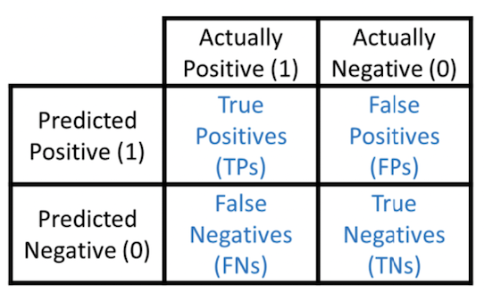

# 评价指标

熟悉统计指标、metrics的意义和计算，对评价指标的熟悉有助于我们进行优化。

- **offline**
  - regression
    - MSE
    - MAE
    - MAPE
  - classification
    - accuracy
    - recall
    - F1 score
    - AUC
  - clustering
    - mutual info
    - rand index
    - silhouette
    - V-measure
  - ranking
    - NDCG
    - [MAP](https://www.kaggle.com/code/debarshichanda/understanding-mean-average-precision)
    - HR
    - recall
- **online**
  - ads
    - ctr
    - cost per acquisition
    - ROAS
  - marketing
    - CAC
    - NPS
    - CLTV
    - shares
  - steaming
    - DAU
    - clicks
    - time spent
    - retention
  - finance
    - ROI
    - alpha
    - beta
    - GAGR


## AB test

- a/b testing如何确定sample size
- 不同element increase/decrease对power的影响


## 精确率Precision/ 召回率Recall/ F1 / AUC



**Precision** = True Positives / (True Positives + False Positives)

**Recall** = True Positives / (True Positives + False Negatives)

**F1** = 2/ (1/P + 1/R)
- the harmonic mean of precision and recall

```python
import numpy as np

def f1(actual, predicted, label):
    """ A helper function to calculate f1-score for the given `label` """
    # F1 = 2 * (precision * recall) / (precision + recall)
    tp = np.sum((actual==label) & (predicted==label))
    fp = np.sum((actual!=label) & (predicted==label))
    fn = np.sum((predicted!=label) & (actual==label))

    precision = tp / (tp + fp)
    recall = tp / (tp + fn)
    f1 = 2 * (precision * recall) / (precision + recall)
    return f1


def f1_macro(actual, predicted):
    # `macro` f1- unweighted mean of f1 per label
    return np.mean([f1(actual, predicted, label)  for label in np.unique(actual)])
```


## AUC(Area Under Curve) / ROC(Receiver Operating Characteristics)曲线
- 什么是ROC curve，什么是sensitivity，什么是specificity，ROC的intuition
  - 横轴为 FPR（假阳率）：FP/(FP+TN)，等同于 1-TNR，FPR 越大，预测为正的样本中负类越多
  - 纵轴为 TPR（真阳率）：TP/(TP+FN)，TPR 越大，预测为正的样本中正类越多
- AUC越大，说明模型把正例放在前面的可能性越大，用来衡量模型的排序能力。**随机从正样本和负样本中各选一个，分类器对于该正样本打分大于该负样本打分的概率**
- Group AUC
- pros
  - AUC衡量的是一种排序能力，threshold-independent, 因此特别适合排序类业务
  - AUC对正负样本均衡并不敏感，在样本不均衡的情况下，也可以做出合理的评估
  - 其他指标比如precision，recall，F1，根据区分正负样本阈值的变化会有不同的结果，而AUC不需要手动设定阈值，是一种整体上的衡量方法
- cons
  - 忽略了预测的概率值和模型的拟合程度
  - AUC反映了太过笼统的信息。无法反映召回率、精确率等在实际业务中经常关心的指标
  - 它没有给出模型误差的空间分布信息，AUC只关注正负样本之间的排序，并不关心正样本内部，或者负样本内部的排序，这样我们也无法衡量样本对于好坏客户的好坏程度的刻画能力


```python
# https://www.kaggle.com/competitions/microsoft-malware-prediction/discussion/76013
# 按预测概率排序，依次计算每个点，得到所有正样本打分大于负样本的个数  / 所有情况随机取一正一负总数m*n
# 类似蒙特卡洛的逆？

import numpy as np
from numba import jit

@jit
def fast_auc(y_true, y_prob):
    y_true = np.asarray(y_true)
    y_true = y_true[np.argsort(y_prob)]
    nfalse = 0
    auc = 0
    n = len(y_true)
    for i in range(n):
        y_i = y_true[i]
        nfalse += (1 - y_i)  # 截至目前负样本0的累加数量
        auc += y_i * nfalse  # 每到一个正样本1，auc更新前面一共多少负样本。此时的数量就是每个正样本，其概率>负样本的概率的和
    auc /= (nfalse * (n - nfalse))  # auc / (负样本数量 * 正样本数量), 分子是每一个正样本，他概率大于负样本的总和
    return auc


def eval_auc(preds, dtrain):
    labels = dtrain.get_label()
    return 'auc', fast_auc(labels, preds), True
```


## KS
- Kolmogorov-Smirnov，风控常用指标
- KS曲线就是将阈值与TPR，FPR的变化趋势反应出来


## average precision
- [sklearn metrics-AP](https://scikit-learn.org/stable/modules/generated/sklearn.metrics.average_precision_score.html)
- AP是Precision-Recall Curve(PRC)下的面积

```python
import numpy as np

def average_precision_score(y_true, y_scores):
    """
    Calculate the average precision score.

    Parameters:
    - y_true: 1D array-like, true binary labels (0 or 1).
    - y_scores: 1D array-like, predicted scores or probabilities for positive class.

    Returns:
    - average_precision: The average precision score.
    """

    # Combine true labels and predicted scores into a sorted list of (true label, score) pairs.
    data = list(zip(y_true, y_scores))
    data.sort(key=lambda x: x[1], reverse=True)

    # Initialize variables for precision, recall, and total positive examples.
    precision_values = []
    recall_values = []
    true_positives = 0
    num_positive_examples = sum(y_true)

    # Calculate precision and recall at each threshold.
    for i, (true_label, score) in enumerate(data, start=1):
        if true_label == 1:
            true_positives += 1
        precision = true_positives / i
        recall = true_positives / num_positive_examples
        precision_values.append(precision)
        recall_values.append(recall)

    # Calculate the average precision by integrating the precision-recall curve.
    average_precision = np.trapz(precision_values, recall_values)
    return average_precision
```


## 问题

- 准确率的局限性
  - 标签不平衡

- MAP与NDCG的比较，以及pros和cons
  - NDCG考虑位置权重，多级相关性（相关、部分相关、不相关），关注**相关性**程度的排序质量


## 参考
- [Evaluation Metrics for Language Modeling](https://thegradient.pub/understanding-evaluation-metrics-for-language-models/)
- [https://scikit-learn.org/stable/modules/model_evaluation.html](https://scikit-learn.org/stable/modules/model_evaluation.html)
- [看完这篇AUC文章，搞定任何有关AUC的面试不成问题](https://zhuanlan.zhihu.com/p/360765777)
- [图解AUC和GAUC - 千寻的文章 - 知乎](https://zhuanlan.zhihu.com/p/84350940)
- [NDCG排序评估指标 - Satellite的文章 - 知乎](https://zhuanlan.zhihu.com/p/448686098)
- [Evaluating recommendation systems (mAP, MMR, NDCG)](https://www.shaped.ai/blog/evaluating-recommendation-systems-map-mmr-ndcg)
-
