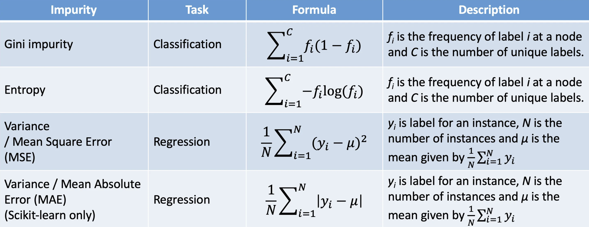

# 决策树

决策树的角度和之前不同，优化思路也不同。其演化过程需要结合ensemble原理（bagging、boosting）。

## 1. 决策树
优化目标: To find the best split that maximize the separation between different classes or reduces the impurity with each resulting node

分裂依据



- 熵 Entropy
  - 熵、联合熵、条件熵、交叉熵、KL散度（相对熵）
  - KL(p|q) = cross entropy(p, q) - H(p)

entropy公式：

$$ H(X) = -\sum_{i=1}^{n} p(x_i) \log p(x_i) $$

- 信息增益 Information Gain

- 基尼系数 Gini impurity

- squared loss


## 2. adaboost

- 损失函数exp
- 对分类正确的样本降低权重，对错误分类的样本升高或者保持全中不变。在模型融合过程中，根据错误率对基分类器器进行加权融合，错误率低的分类器拥有更大的“话语权”


## 3. 随机森林

- 损失函数：

- 可以并行训练，不容易过拟合


## 4. 梯度提升树GBDT

- GBDT拟合的是负梯度，下一棵树拟合的是前面的负梯度。当损失函数为平方损失的时候，负梯度正好为残差
- 做分类任务时，GBDT内部每棵树是回归树，不论是回归还是分类任务
- Importance is calculated for a single decision tree by the amount that each attribute split point improves the performance measure, weighted by the number of observations the node is responsible for
- summing up how much splitting on each feature allowed you to reduce the impurity across all the splits in the tree


## 5. xgboost
- XGBoost使用二阶泰勒展开(taylor expansion)表示梯度，即每棵树拟合的是二阶泰勒的梯度，相比GBDT的一阶泰勒展开、对梯度的表示更准确
- 损失函数中显式加入了正则项，对叶子数目和叶子权重做惩罚
- 特征重要性
  - 'Split' contains numbers of times the feature is used in a model. 作为划分属性的次数, 默认值(导致一些ID类基数大容易成为重要特征)
  - 'Gain' result contains total gains of splits which use the feature. 特征在作为划分属性时loss的降低量
  - 'cover'，特征在作为划分属性时对样本的覆盖度
- 基于预排序方法加速

$$ f(x+\Delta x) \approx f(x) + f'(x)\Delta x + \frac12 f''(x)\Delta x^2 $$


## 6. lightgbm
- 基于Histogram: lightgbm遍历每个特征寻找最优分裂点时，将每个特征进行了分桶，比如可指定分为64个桶，那么该特征所有的值都落入这64个桶中，遍历这个特征时，最多只需要遍历64次，则每次分裂的复杂度为O(特征数*桶数)，如果不分桶，则可能所有样本的值都不同，则复杂度为O(特征数*样本数)。
为什么能分桶：因为每棵树都是弱分类器，不需要非常精准，且分桶一定程度上提高了泛化能力，降低了误差
- lightgbm的分枝模式为leaf-wise，即遍历当前所有待分枝节点，不需要一定在最下边一层，谁的分裂增益大就分谁。而XGBoost的分枝模式为level-wise，即分完一层再分下一层，可能一层中有些叶子分裂增益极小，但是仍然要花费时间和空间去分裂
- 单边梯度采样（Gradient-based One-Side Sampling，GOSS）：使用GOSS可以减少大量只具有小梯度的数据实例，这样在计算信息增益的时候只利用剩下的具有高梯度的数据就可以了
- 互斥特征捆绑（Exclusive Feature Bundling，EFB）：使用EFB可以将许多互斥的特征绑定为一个特征，这样达到了降维的目的
- Cache命中率优化


## 7. catboost


## 8. 特征重要性
- 所有树中作为划分属性的次数
- 使用特征在作为划分属性时loss平均的降低量
- 作为划分属性时对样本的覆盖度

- permutation
- SHAP


## 9. 问答

- GBDT中的梯度与深度学习的梯度优化方法？
  - 二者都是借助梯度进行优化，GBDT是下一颗树拟合，深度学习是向后传播
  - GBDT中计算的梯度是针对每个样本的，m个样本的回归任务其梯度shape是m, 分类任务取决于类别数量
  - 深度学习中最后一层是针对样本的，其他layer每一层都有针对可训练的weights梯度
- xgboost的cache awareness如何提高计算效率？
- 如何并行
    - Boosting算法的弱学习器是没法并行迭代的，但是单个弱学习器里面最耗时的是决策树的分裂过程，XGBoost针对这个分裂做了比较大的并行优化。在训练之前，预先对每个特征内部进行了排序找出候选切割点，然后保存为block结构，后面的迭代中重复地使用这个结构，大大减小计算量。在进行节点的分裂时，需要计算每个特征的增益，最终选增益最大的那个特征去做分裂，那么各个特征的增益计算可以多线程进行，即在不同的特征属性上采用多线程并行方式寻找最佳分割点。

- xgboost如何快速分裂


- xgboost分类节点的依据


- xgboost如何处理缺失值
  - 寻找split point的时候，忽略缺失值，该特征为missing的样本不进行遍历统计，只统计non-missing的样本，这个工程技巧减少了为稀疏离散特征寻找split point的时间开销
  - 训练时，分别将特征missing的样本分配到左叶子结点和右叶子结点，分到那个子节点带来的增益大，默认的方向就是哪个子节点
  - 推理时，如果训练过程中，出现过缺失值，则按照训练过程中缺失值划分的方向（left or right），进行划分；如果训练过程中，没有出现过缺失值，将缺失值的划分到默认方向（左子树）
- xgboost如何正则化的
  - 代价函数里加入了正则项，树的叶子节点个数、每个叶子节点上输出的score的L2

- 树模型的缺点
  - 在回归的外推问题

- 模型细节
  - 模型里有特别大的值对结果有什么影响，需要如何处理

- random forest每个node怎么做split

- GBM中的gradient怎么定义


## 10. 代码
Decision Tree


```python
import numpy as np

class Decision_node():
    pass

class Decision_tree():
    pass
```

回到损失函数，如xgboost中如何自定义损失函数
```python

```


## 参考
- [从sklearn源码简析GBDT](https://mp.weixin.qq.com/s/iKxv9-fHJp2DFQyeWlvTgQ)
- [【机器学习】决策树（上）——ID3、C4.5、CART](https://zhuanlan.zhihu.com/p/85731206)
- [【机器学习】决策树（中）——Random Forest、Adaboost、GBDT](https://zhuanlan.zhihu.com/p/86263786)
- [【机器学习】决策树（下）——XGBoost、LightGBM](https://zhuanlan.zhihu.com/p/87885678)
- [机器学习-LightGBM - 马一凡的文章 - 知乎](https://zhuanlan.zhihu.com/p/105954452)
- [Productionizing Distributed XGBoost to Train Deep Tree Models with Large Data Sets at Uber](https://www.uber.com/en-HK/blog/productionizing-distributed-xgboost/)
- [Use XGBoost with the SageMaker Python SDK](https://sagemaker.readthedocs.io/en/stable/frameworks/xgboost/using_xgboost.html)
