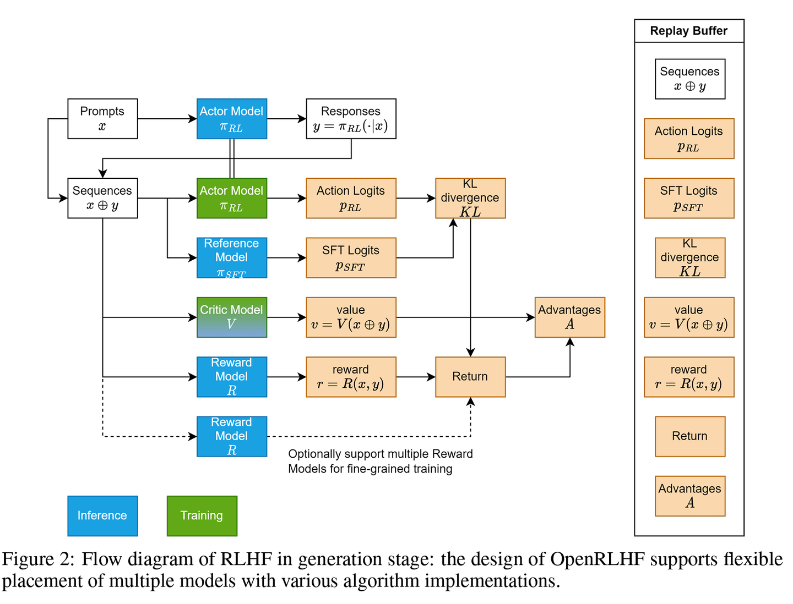
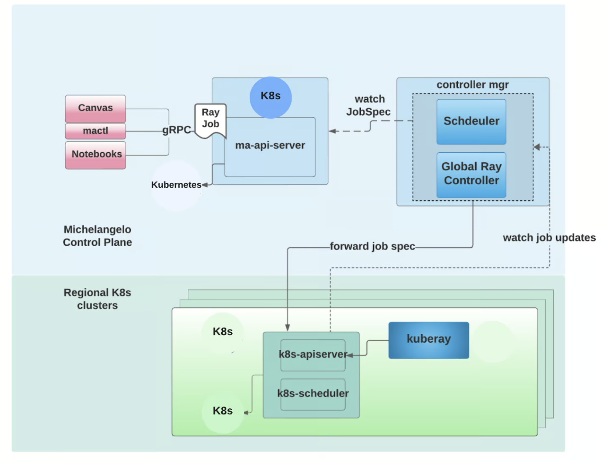
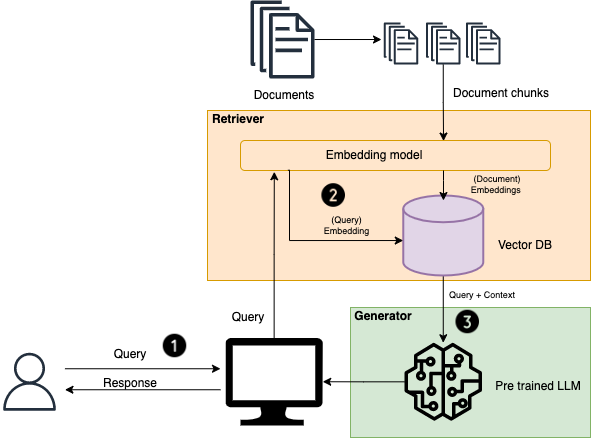

# 大语言模型LLM

熟悉[深度学习](./05_deep_learning.md)、[自然语言理解](./11_nlp.md)、[分布式机器学习](./15_distributed_ml.md)

## 1. scaling law

[Transformer Math 101](https://blog.eleuther.ai/transformer-math/)

- C(计算量) = 6 N(模型参数量) \* D(数据集大小)
- 基础：1个字节8比特，全精度(fp32)下，**1个参数** 32 byte = **4个字节**，半精度下1个参数等于2个字节
- 1B 模型代表 1 billion参数，如果全精度，共需要 4 billion显存，也就是4G. 半精度需要2G显存。
- 全量微调: 参数，梯度，优化器. 微调1B模型，全精度：参数4G, 梯度4G, 优化器状态（adam带二阶状态）8G = 16G. 半精度Adam微调需要 8G
- LoRA微调: 主干网络前向和梯度显存消耗不变，节省的显存主要在优化器状态，优化器只有LoRA权重部分

## 2. 数据

- 多样性(diversity)：不同情景、背景、语境
  - 采集方式：随机无偏差
- 数量(size)
- 质量(quality)：重要

- LLM-as-judge
- 拒绝采样

## 3. 模型

**LLaMa**

- https://github.com/naklecha/llama3-from-scratch
- llama的self-attention和mlp中没有bias
- norm 使用 rmsnorm 而不是 layernorm，少计算了均值. 使用 pre-norm
- 激活函数 使用[swiglu](https://arxiv.org/abs/2002.05202)
- 位置编码 使用[RoPE](https://arxiv.org/abs/2104.09864)
- Multi-query Attention 和 [Grouped-Query Attention](https://arxiv.org/abs/2305.13245)

**Mistral**

**QWen**

**Deepseek**
- MLA, MOE, RMSNorm, DeepGEMM

**MOE**
- 稀疏激活: 前向传播时只激活一小部分专家
```python
import torch
from torch import  nn

class MoeLayer(nn.Module):
    def __init__(self, experts, gate, moe_args):
        super().__init__()
        assert len(experts) > 0
        self.experts = nn.ModuleList(experts)
        self.gate = gate
        self.args = moe_args

    def forward(self, inputs: torch.Tensor):
        inputs_squashed = inputs.view(-1, inputs.shape[-1]) # (m, seq_len, dim) --> (m * seq_len, dim)
        gate_logits = self.gate(inputs_squashed) # (m * seq_len, num_experts)
        # (m * seq_len, num_experts_per_tok),
        weights, selected_experts = torch.topk(
            gate_logits, self.args.num_experts_per_tok)
        weights = nn.functional.softmax(
            weights, dim=1, dtype=torch.float).type_as(inputs)
        # (m * seq_len, dim)
        results = torch.zeros_like(inputs_squashed)
        for i, expert in enumerate(self.experts):
            # index of batch and expert
            batch_idx, nth_expert = torch.where(selected_experts == i)
            # weightage * output of expert layers (selected_m, num_expert)
            results[batch_idx] += ( weights[batch_idx, nth_expert, None] * expert(inputs_squashed[batch_idx]) )
        # (m * seq_len, dim) --> (m, seq_len, dim)
        return results.view_as(inputs)
```

**RoPE**

$$
\langle f_g(c_m, m), f_k(c_n, n) \rangle = g(c_m, c_n, m - n)
$$

```python
import torch

class Rotary(torch.nn.Module):
    def __init__(self, dim, base=10000):
        super().__init__()
        inv_freq = 1.0 / (base ** (torch.arange(0, dim, 2).float() / dim))
        self.register_buffer("inv_freq", inv_freq)
        self.seq_len_cached = None
        self.cos_cached = None
        self.sin_cached = None

    def forward(self, x, seq_dim=1):
        seq_len = x.shape[seq_dim]
        if seq_len != self.seq_len_cached:
            self.seq_len_cached = seq_len
            t = torch.arange(x.shape[seq_dim], device=x.device).type_as(self.inv_freq)  # [max_len, 1]
            freqs = torch.einsum("i,j->ij", t, self.inv_freq)  # [max_len, dim // 2]
            emb = torch.cat((freqs, freqs), dim=-1).to(x.device)
            self.cos_cached = emb.cos()[:, None, None, :]
            self.sin_cached = emb.sin()[:, None, None, :]
        return self.cos_cached, self.sin_cached


def rotate_half(x):
    x1, x2 = x[..., : x.shape[-1] // 2], x[..., x.shape[-1] // 2 :]
    return torch.cat((-x2, x1), dim=x1.ndim - 1)


@torch.jit.script
def apply_rotary_pos_emb(q, k, cos, sin):
    # q, k: [seq, batch, heads, hdim]
    return (q * cos) + (rotate_half(q) * sin), (k * cos) + (rotate_half(k) * sin)
```

## 4. 训练

- limited GPU
  - use fp16 (this speeds up training)
  - use gradient_accumulation_steps (this simulates larger batch sizes)
  - use gradient_checkpointing (this uses disk to save RAM)
  - freeze model embeddings (this reduces weights to train)
  - freeze some model layers (this reduces weights to train)
  - use PEFT (this reduces weights to train)
  - increase LR and decrease epochs (this reduces work)
  - use smaller models (this reduces weights to train)

### 4.1 pretrain

> 数据清洗方法、pretrain数据配比、pretrain超参数、退火阶段

### 4.2 SFT

> task种类、sft数据量级、合成数据

**高效参数微调 PEFT**

- Prompt tuning

  - 固定模型前馈层参数，仅仅更新部分embedding参数即可

- Adapter Tuning

  - 所有参数微调较为低效，只微调下游的几层效果不佳。因此设计了adapter结构，在原结构中稍微增加了参数，只微调该部分，效果接近full-finetune
  - down-project层将高维度特征映射到低维特征，过一个非线形层之后，再 up-project 结构将低维特征映射回原来的高维特征. skip-connection 结构，确保在最差的情况下退化为 identity

- Prefix Tuning 前缀微调

  - 问题：最终的性能对人工设计的template的特别敏感，加一个词或者少一个词，或者变动位置，都会造成很大的变化
  - 使用连续的virtual token embedding来代替离散的token. 将一个连续的特定于任务的向量序列添加到输入，称之为前缀. Prefix是可以学习的“隐式”的提示，训练的时候只更新Prefix部分的参数，而Transformer中的预训练参数固定

- p-tuning

  - 自然语言的离散模版转化为可训练的隐式prompt

- LoRA 低秩自适应
  - 用低秩的方式（一个矩阵可以用两个较小的矩阵相乘来近似）来调整参数矩阵.
  - 冻结预训练好的模型权重参数, 通过往模型中加入额外的网络层，并只训练这些新增的网络层参数
  - QLoRA: Quantized LoRA, 使用QLoRA算法要结合bitsandbytes库和peft库

```python
input_dim = 768
output_dim = 768
rank = 8  # 低秩适应的等级'r'
W = ...  # 来自预训练网络的权重，形状为 input_dim x output_dim
W_A = nn.Parameter(torch.empty(input_dim, rank))  # LoRA权重A
W_B = nn.Parameter(torch.empty(rank, output_dim))  # LoRA权重B
# 初始化LoRA权重
nn.init.kaiming_uniform_(W_A, a=math.sqrt(5))
nn.init.zeros_(W_B)

def regular_forward_matmul(x, W):
  h = x @ W
  return h

def lora_forward_matmul(x, W, W_A, W_B):
  h = x @ W  # 常规矩阵乘法
  h += x @ (W_A @ W_B) * alpha  # 使用缩放的LoRA权重
  return h
```

### 4.3 RLHF

> - RLHF 与 RLAIF: better align with human preferences and reduce undesired outcomes in scenarios
> - SFT负责Instruction following，RL强化helpfulness、honesty、safety偏好
> - SFT不具备向后看的能力，只能看到当Token前面的句子；RLHF的critic model和reward model都能看到当前位置后面的句子，所以RLHF能看到整个句子
> - SFT给的都是正例，没有负反馈；RLHF通过给序列一个低分给模型负反馈，减少生成某个token的概率
> - online RL 的训练数据是当场采集而来，一边造数据，一边训练模型
> - dpo / ppo 训练技巧, 相关模型参考[强化学习](./10_reinforcement.md)

[https://github.com/OpenRLHF/OpenRLHF](https://github.com/OpenRLHF/OpenRLHF)



### 4.4 Long context

**位置编码内插与外推**

- Position Interpolation
- NTK
- YaRN


**工程**

- 序列并行（SP）: 将输入序列进行切分
- RingAttention Ulysses
- KV量化

### 4.5 reasoning

## 5. 评测

- rouge
- BLEU
- perplexity

## 6. 推理

- [Towards Efficient Generative Large Language Model Serving](https://arxiv.org/pdf/2312.15234)
- [Mastering LLM Techniques: Inference Optimization](https://developer.nvidia.com/blog/mastering-llm-techniques-inference-optimization/)
- throughput 吞吐
  - 估算：单次推理时间 x 同时处理的请求数量
- 推理prefill阶段是compute bound，算力利用充分；decode阶段是memory bound，算力卡在内存访问上
- [解码方式](https://huggingface.co/blog/how-to-generate): 贪心搜索 (Greedy search)、波束搜索 (Beam search)、Top-K 采样 (Top-K sampling) 以及 Top-p 采样 (Top-p sampling)，投机采样 (speculative sampling), lookahead decoding
  - 贪心选择每一步都选最大的，top_k和top_p从top中随机选择一个，beam search保留多个
  - [投机采样 Speculative Decoding](https://proceedings.mlr.press/v202/leviathan23a/leviathan23a.pdf)
- dynamic batching, continuous batching
- flash attention, paged attention
- quantization: fp8, bf16, gptq, awq
- 算子优化: gemm，transpose，mha，rmsnorm，gemv，rope


**KV cache**

> 空间换时间，最新的token计算attention时，与前面的KV计算无关. 下面公式计算attention3时，用到的仍然是K1V1 和 K2V2
>
> - [Transformers KV Caching Explained](https://medium.com/@joaolages/kv-caching-explained-276520203249)
> - [LLM Inference Series: 3. KV caching explained](https://medium.com/@plienhar/llm-inference-series-3-kv-caching-unveiled-048152e461c8)
> - [大模型推理优化技术-KV Cache](https://mp.weixin.qq.com/s/XRtU1cnn1GX2J3oCDHKOtA)

$$
\begin{align*}
\text{Att}_1(Q, K, V) &= \text{softmax}(Q_1 K_1^T) V_1 \\
\text{Att}_2(Q, K, V) &= \text{softmax}(Q_2 K_1^T) V_1 + \text{softmax}(Q_2 K_2^T) V_2 \\
\text{Att}_3(Q, K, V) &= \text{softmax}(Q_3 K_1^T) V_1 + \text{softmax}(Q_3 K_2^T) V_2 + \text{softmax}(Q_3 K_3^T) V_3
\end{align*}
$$

**MQA(multi query attention) / GQA(group query attention)**

- 通过平均池化组内的所有原始头来构建

**quantization 量化**

- Post training quantization(PTQ)
  - OBS(Optimal Brain Surgeon) -> OBQ(Optimal Brain Quantization) -> **GPTQ**
- Quantization aware training(QAT)

**flash-attention**

> 通过矩阵分块计算以及减少内存读写次数的方式，提高注意力分数的计算效率
>
> - [图解大模型计算加速系列：FlashAttention V1，从硬件到计算逻辑 - 猛猿的文章 - 知乎](https://zhuanlan.zhihu.com/p/669926191)

输入QKV分块，保证每个块能够在SRAM（一级缓存）上完成注意力操作，并将结果更新回HBM(高带宽内存)，从而降低对HBM的读写操作.

**paged-attention**

> 针对增量解码阶段，对于 KV 缓存进行分块存储，并优化了计算方式，增大了并行计算度，从而提高了计算效率
>
> - [图解大模型计算加速系列之：vLLM核心技术PagedAttention原理 - 猛猿的文章 - 知乎](https://zhuanlan.zhihu.com/p/691038809)

**蒸馏**

**triton**

- dynamic batching、concurrent execution、optimal model configuration、model ensemble、dali model 等策略来提升在线推理的性能

**框架**

## 7. 应用与优化



### 7.1 prompt

- https://platform.openai.com/docs/guides/prompt-engineering
- https://yiyan.baidu.com/learn
- https://lilianweng.github.io/posts/2023-03-15-prompt-engineering/
- https://huggingface.co/blog/chat-templates

**COT**

- 根据llm的self reflection做planning

**Few Shot**

### 7.2 in context learning

- 通过展示数据形式，来激活预训练模型的能力
- examples采样：从训练数据中选择与query语义相近的示例，效果会比较好

### 7.3 RAG

- 主要针对大语言模型的幻觉、数据时效性、数据安全问题
- LangChain



### 7.4 Agents

[https://www.anthropic.com/research/building-effective-agents](https://www.anthropic.com/research/building-effective-agents)

[LLM Powered Autonomous Agents](https://lilianweng.github.io/posts/2023-06-23-agent/)

**tool usage**
```python
import re

def extract_action_and_input(text):
  action_pattern = r"Action: (.+?)\n"
  input_pattern = r"Action Input: \"(.+?)\""
  action = re.findall(action_pattern, text)
  action_input = re.findall(input_pattern, text)
  return action, action_input
```

### 7.5 大规模部署

- 容器化 + k8s
- 负载均衡和路由算法
- 自动扩容/缩容
- 状态检测

## 8. 问答

- 一个给定任务，如何优化LLM的效果
  - 从prompt engineering开始
  - RAG
  - fine tuning
- attention的加速优化
  - flash-attention 及 S2attention
- 如何扩展LLM的token
  - position embedding的角度
  - [Advancing Transformer Architecture in Long-Context Large Language Models: A Comprehensive Survey](https://arxiv.org/abs/2311.12351v1)
- 如何构建Instruction数据集
  - 语料生成，格式构造，提示词
- 如何处理训练中的loss spike
  - [adam在大模型预训练中的不稳定性分析及解决办法 - 丁晖的文章 - 知乎](https://zhuanlan.zhihu.com/p/675421518)
- 知识幻觉(track and solve hallucination)
  - 数据(数据重复、Bias、时效性， 一对多的映射关系)，训练（Imperfect representation learning、Parametric knowledge bias）
- conflation
- 复读机问题/ 文本生成的重复问题
  - 多样性训练数据
  - 引入噪声
  - 温度参数调整
  - 后处理和过滤
- 灾难性遗忘
  - 微调过程中混合通用知识指令微调数据，数据配比
  - full or LoRA
  - 重播缓冲区
  - 弹性权重共享
  - 增量学习
  - 多任务学习
  - 数据分布差异
  - 参数更新冲突
- Zero 应用的时候performance严重下降，为什么
- 怎么控制GAI不要给虚假答案
  - constitutional AI，red teaming 去帮助模型规范作答
  - fine tune一个小模型给specific task
- 文本生成的多跳问题
  - 预填充（Prefill）：prompt token一次性读进显存；生成（Completion）：自回归方式一次生成一个新 Token
  - https://mp.weixin.qq.com/s/N0sjdNo-qWdZJ4UkXm-bdw
- 随着模型的增大，学习率越来越小。学习率与数据量、批量大小都没有明显的关系，且一般使用1e-3左右的学习率
- reducing LLM latency at inference time
- SwiGLU

## reference

**精读**

- [Scaling Laws for Neural Language Models](https://arxiv.org/pdf/2001.08361.pdf)
- [MiniCPM: Unveiling the Potential of Small Language Models with Scalable Training Strategies](https://arxiv.org/pdf/2404.06395)
- [Llama 2: Open Foundation and Fine-Tuned Chat Models](https://arxiv.org/pdf/2307.09288)
- [https://github.com/pytorch-labs/gpt-fast](https://github.com/pytorch-labs/gpt-fast)
- [https://github.com/meta-llama/llama3](https://github.com/meta-llama/llama3)
- [https://github.com/x1xhlol/system-prompts-and-models-of-ai-tools](https://github.com/x1xhlol/system-prompts-and-models-of-ai-tools)

**扩展**

- [A Survey of Large Language Models](https://arxiv.org/abs/2303.18223)
- [A Comprehensive Survey on Pretrained Foundation Models A History from BERT to ChatGPT](https://arxiv.org/abs/2302.09419)
- [LLM推理优化技术综述：KVCache、PageAttention、FlashAttention、MQA、GQA](https://zhuanlan.zhihu.com/p/655325832)
- [The Rise and Potential of Large Language Model Based Agents: A Survey]()
- [SearchAnything](https://github.com/Immortalise/SearchAnything)
- [A Survey of Techniques for Maximizing LLM Performance](https://www.youtube.com/watch?v=ahnGLM-RC1Y)
- [https://github.com/NVIDIA/FasterTransformer](https://github.com/NVIDIA/FasterTransformer)
- [大模型检索增强生成（RAG）有哪些好用的技巧？ - Breezedeus的回答 - 知乎](https://www.zhihu.com/question/625481187/answer/3292724588)
- [FlashAttention 的速度优化原理是怎样的？](https://www.zhihu.com/question/611236756/answer/3310819022)
- [语言模型之Text embedding（思考篇） - 泽龙的文章 - 知乎](https://zhuanlan.zhihu.com/p/655310436)
- [大模型词表扩充必备工具SentencePiece - 吃果冻不吐果冻皮的文章 - 知乎](https://zhuanlan.zhihu.com/p/630696264)
- [十分钟读懂旋转编码（RoPE） - 绝密伏击的文章 - 知乎](https://zhuanlan.zhihu.com/p/647109286)
- [大模型基础组件之位置编码-万字长文全面解读LLM中的位置编码与长度外推性（上） - OpenLLMAI的文章 - 知乎](https://zhuanlan.zhihu.com/p/626828066)
- [KV cache详解 图示，显存，计算量分析](https://zhuanlan.zhihu.com/p/646577898)
- [TH LLM Study Group 20231201](https://colab.research.google.com/drive/14Ls0gQktcuy4HYGQc0yY86X4sJ1lK2T8?usp=sharing#scrollTo=KMcHEPV-oAs0)
- [大语言模型是如何在预训练的过程中学习超长文本的呢？ - 段淇源的回答 - 知乎](https://www.zhihu.com/question/621810553/answer/3287188454)
- [让LLM更好地学会中文：大模型继续预训练实践纪录 - Lil2J的文章 - 知乎](https://zhuanlan.zhihu.com/p/677653373)
- [如何解释大模型的重复生成现象？ - 慕谦或谦修的回答 - 知乎](https://www.zhihu.com/question/616130636/answer/3164017394)
- [MOE多卡](https://github.com/facebookresearch/fairscale/issues/871)
- [https://github.com/lucidrains/mixture-of-experts](https://github.com/lucidrains/mixture-of-experts)
- [大语言模型（LLM）评价指标小汇总 - 花师小哲的文章 - 知乎](https://zhuanlan.zhihu.com/p/641416694)
- [flash-attention](https://github.com/Dao-AILab/flash-attention)
- [outlines: Structured Text Generation](https://github.com/outlines-dev/outlines)
- [vllm](https://github.com/vllm-project/vllm)
- [LLM inference in C/C++](https://github.com/ggerganov/llama.cpp)
- [LLM训练-pretrain - ybq的文章 - 知乎](https://zhuanlan.zhihu.com/p/718354385)
- [LLM训练-sft - ybq的文章 - 知乎](https://zhuanlan.zhihu.com/p/809229182)
- [https://github.com/princeton-nlp/LESS](https://github.com/princeton-nlp/LESS)
- [https://github.com/yihedeng9/rlhf-summary-notes](https://github.com/yihedeng9/rlhf-summary-notes)
- [Open Source and In-House: How Uber Optimizes LLM Training](https://www.uber.com/en-SG/blog/open-source-and-in-house-how-uber-optimizes-llm-training/)
- [vLLM源码之PageAttention - 手抓饼熊的文章 - 知乎](https://zhuanlan.zhihu.com/p/711304830)

**课程**

- https://github.com/mlabonne/llm-course
- https://github.com/InternLM/Tutorial/tree/camp2
- https://github.com/datawhalechina/llm-universe
- https://github.com/rasbt/LLMs-from-scratch/tree/main
- https://github.com/peremartra/Large-Language-Model-Notebooks-Course
- https://hanlab.mit.edu/courses/2024-fall-65940
- https://stanford-cs336.github.io/spring2025/
