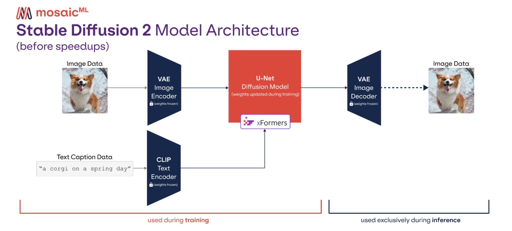

# AIGC
自然语言处理见[LLM章节](./12_llm.md)，多模态见[多模态章节](./14_multimodal.md)

## 任务
文本生成相关：文本数据的收集、整理、过滤、清洗等，需要大模型针对垂类领域进行优化、训练、部署。
图像生成相关：文本生成图像，图像生成图像，文本生成视频，文本生成语音。GAN、扩散模型、图像生成、多模态生成等。

分布式训练、蒸馏加速

Python、Kubernetes、Docker、Kafka、Redis、MongoDB

LORA，P-Tuning

LLM基本原理和相关公开算法，如

人机对话、知识图谱、机器翻译

## Stable Diffusion
扩散模型

- autoencoder (VAE)
- U-Net
- text-encoder, CLIP’s Text Encoder

## 问答
- diffusion model和stable diffusion公司的latent diffusion model特点
- Diffusion process

## 参考
- https://github.com/DeepTecher/awesome-ChatGPT-resource-zh
- https://github.com/hua1995116/awesome-ai-painting
- https://www.zhihu.com/question/577079491/answer/2954363993
- https://www.zhihu.com/question/596230048
- [生成模型大道至简｜Rectified Flow基础概念｜代码 - 养生的控制人的文章 - 知乎](https://zhuanlan.zhihu.com/p/687740527)
- [pytorch-stable-diffusion](https://github.com/hkproj/pytorch-stable-diffusion)
- [Diffusion学习路径记录（2023年） - Kylin的文章 - 知乎](https://zhuanlan.zhihu.com/p/605973097)
