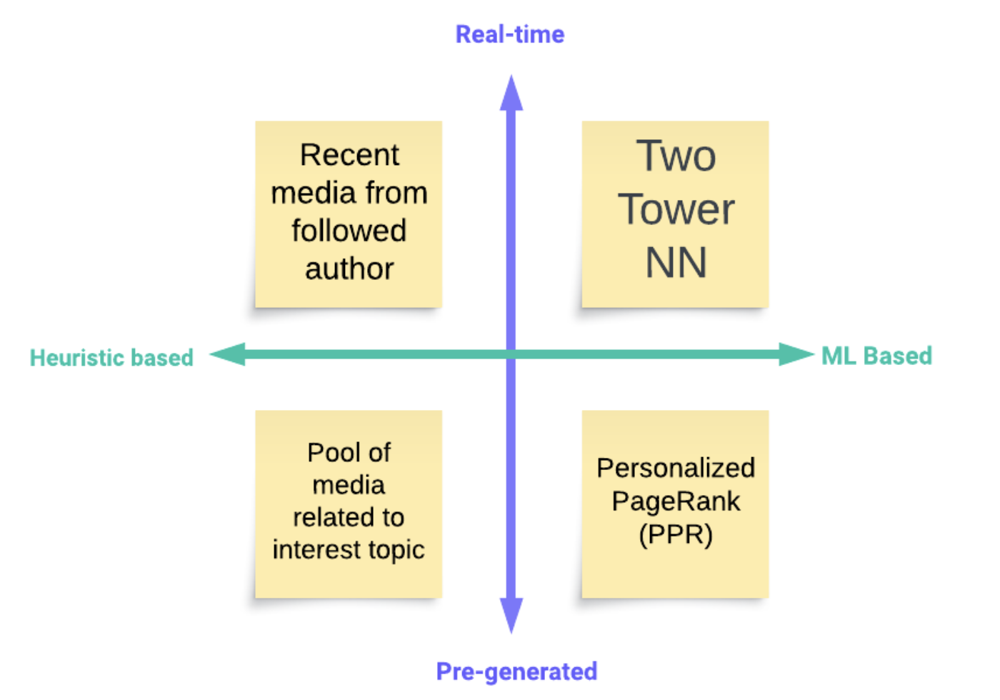

# 推荐系统
配合 [机器学习系统设计：推荐系统](../03_system/03_ml/recommendation.md)

## 1. 业务
推荐系统是一个**优化**过程，设定目标，通过优化使目标最大化。常见推荐系统大多是i2u，即把物品推荐给用户，不过也有friend recommendation这种u2u的推荐。
- 整体流程一般是: 召回、排序(粗排、精排)、策略

**推荐与搜索的区别：**
- 搜索是用户的主动行为，带query，返回结果与query的相关性非常重要. 第一是保证相关性，第二才是增强个性化

**广告和推荐的区别：**
- 广告除了平台和用户，多了广告主一方。因此需要关注平台、广告主ROI、用户体验的平衡
- 搜索可以认为有正确答案的，人主动找item；广告是item找人; 推荐是人被动接收信息
- 广告点击率更低，正样本非常少
- 推荐注重相对顺序(precision/auc)，广告注重score本身(logloss)
- 广告侧变动比较快，为了收益更快更新候选，在线召回. 推荐往往只需离线算出候选集(候选集低频更新时)然后在线ranking

## 2. 模型

### 2.1 召回

从**海量**物品库里**快速**找出用户可能感兴趣的物品 （亿 -> 千）
- 多通道召回(multiple source), Negative Sampling
- 统计类，热度，LBS，如：全城热搜、区域热搜；行为，如：看过、买过、看了又看、搜了又搜；
- 协同过滤类，UserCF、ItemCF
  - 协同过滤，推荐时同时考虑了该用户交互过的"物品"，以及与该用户相似的其他"用户"，是为协同。Content-based filtering doesn't look at other users
  - [基于物品的协同过滤i2i--算法、trick及分布式实现](https://zhuanlan.zhihu.com/p/350447698)
- U2T2I，如基于user tag召回
- **I2I**，如Embedding（Word2Vec、FastText），GraphEmbedding（Node2Vec、DeepWalk、EGES）
- U2I，如DSSM、YouTube DNN、Sentence Bert
  - 向量召回

**双塔**
- 用户塔特征 user feature+context feature，商品塔的特征商品属性及基础特征
- 训练时cosine similarity, 服务时ANN搜索
- 正样本：热度非均匀采样；负样本：简单负样本(全量item抽取)，困难负样本（粗排 精排筛选掉的），不能包含曝光未点击(可能有兴趣)
  - 全局负采样最好，但实现成本更高。batch内负采样更简单，但热门的item更容易成为负样本，会打压热门，可以通过logQ矫正来解决。
- point-wise，pair-wise, list-wise
- 物料由于数量非常大，特性相对稳定，存入向量数据库。用户兴趣可能快速变化，embed根据权重重新计算，并从物料向量数据库中knn搜索

**评价指标**

离线:
- 召回精度：衡量召回链路Top-N召回的准确性。
  - 一般采用Recall@K、Precision@K、F1@K、Hit-rate@K, AUC, MRR(Mean Reciprocal Rank), GAUC(计算同一个广告不同用户的auc加权平均)
  - Hit Ratio (HR, 命中率)
  - Mean Reciprocal Rank (MRR, 平均倒数排名, focuses on the rank of the first relevant item in the list)
  - Normalized Discounted Cumulative Gain (NDCG, 归一化折损累计增益, works well when the relevance score between a user and an item is non-binary)
  - 此外，mAP: works only when the relevance scores are binary
- 召回覆盖率：衡量召回链路对于长尾item的挖掘能力。
  - 召回item在整个物料池的占比；
  - 去掉top1%的item，再比较召回精度
- 召回多样性：衡量召回链路对用户不同的兴趣领域的覆盖度。
  - 以类目为用户兴趣领域，比较类目宽度。
- 召回新颖性：衡量召回链路能否给用户推荐没有过行为的item。
  - 计算召回item的平均流行度，平均流行度如果越低，那么可以认为召回的新颖度越高

在线: 
- ctr、cvr、gmv(商品交易总额), pctr, pGMV, discovery=(#new categories)/(#all categories)，discovery分母是用户每天点击的总类别数，而分子是过去15天里头的新类别
- 日/月活跃用户（DAU/MAU），用户互动量/率（包括转赞评），用户停留时长
- A/B Test：观测效率指标，曝光占比、点击率、多样性、新颖性等指标
  - 对于曝光占比少的链路，可进一步观测如下数据
    - trigger用户覆盖度，这个衡量的是召回链路能够对多少用户产生影响；
    - trigger内容覆盖度，这个衡量的是我们所构建的trigger是否有相应的内容。
  - 对于效果差的链路，可分人群观测下效果，进一步精细化召回

counterfactual evaluation（反事实评估）
- 考虑“如果...将会...”的情景来评估推荐结果的可信度和解释的质量

**优化**

- 如何进行优化？ (方法论角度 + 找到关键问题)
  - 用户体验角度
  - 指标优化角度
  - 目标、样本、特征网络
- 双塔: 样本（困难样本）,模型结构（DCN, last-N行为序列, 多向量模型: 多个用户塔对应多个目标），模型训练方法（二分类，batch内负采样，自监督）
- I2I: 除了u2i2i （itemCF, item embedding similarity）外，添加更多通道如u2a2i(author)
- 召回总量不变，调整召回通道配额
- [双塔的优化-知乎](https://www.zhihu.com/question/314773668/answer/2259594886)
  - 让user和item更有效地交互
  - 让单路召回达到多路的效果
  - 面向后链路的一致性建模
  - 各种工业经验trick，包括但不限于特征、结构、loss

### 2.2 排序

- 特征工程，多目标排序，复杂网络
- learning to rank 流程三大模式（point-wise、pair-wise、list-wise），主要是特征工程和CTR模型预估。pairwise在搜索排序中提出，在推荐排序中效果有可能比pointwise差。
- 常见的特征挖掘（user、item、context，以及相互交叉）
- 粗排：**双塔**, 小规模神经网络
  - 一种是级联粗排，拟合精排的结果，正样本选择精排的topk，负样本选择精排的尾部（排序结果最后几名）或者从召回的结果随机选择一些；
  - 另一种和精排一样，直接拟合真实的用户行为。学习样本的ground truth上限更高，但和精排的一致性可能没那么好，粗排的结果可能精排不给通过

- 精排：**MLP**, 大规模神经网络
- CTR预估，如LR、GBDT、FM、FFM、DNN、Wide&Deep、DCN、DCNv2、DeepFM、DIN、xDeepFM、WDL、DIEN
  - Binary Cross Entropy Loss, Pairwise LTR Loss
- 多目标多场景：MMOE
- 特征：user, item, context
- light ranking/ heavy ranking

**评价指标**
- 排序模型的评估指标，比较常见的有NDCG(Normalized Discounted Cumulative Gain)、MRR、MAP、PNR
- counterfactual evaluation (offline policy evaluation):
  - [Counterfactual Evaluation of Slate Recommendations with Sequential Reward Interactions](https://arxiv.org/abs/2007.12986)

**优化**
- 特征工程: 添加更多特征表征，cross feature, sequence feature
- 在线学习 (continual online training)

### 2.3 重排

- 目标：提升结果的效率（点击、购买、GMV等）；提升结果的多样性、发现性和用户体验；降低负反馈（结果同质化严重、看/点/买了还推）
- 新手扶持流量，试试效果再决定
- 多样性抽样(MMR，DPP)
  - Do not show items from the same authors in a sequence
  - MMR的滑窗
- 插入广告
- removing potentially harmful content

### 2.4 探索与发现

- bandit(多臂老虎机)、Q-Learning、DQN

### 2.5 Infra

- Realtime approximate nearest neighbours systems (eg. Annoy, Faiss.)
- Text indexing systems (Lucene, Elasticsearch)
- Database and distributed data systems like Spark
- Serving systems (TFX)
- Model tracking and Management systems (Kubeflow, MLFlow)

## 3. 问答

### How to scale
- the component of retrieval and ranking is already designed for scale
- read the code from [dlrm](https://github.com/facebookresearch/dlrm/blob/f06d3deed5a15710fb28e0ede0af31ebd53789cb/data_loader_terabyte.py#L350)
- parameter server

### Serve personalized recommendations at a low latency

### Bias

- selection bias: 用户倾向于给非常喜欢或者非常不喜欢的打分
- positional bias: 用户倾向于点击位置靠前的
  - 样本: 样本权重（位置靠后的权重高），更严格定义正负样本（如 above click）
    - Inverse Propensity Weighting: 对 position bias 进行量化，将其作为训练样本的权重来实现消偏的效果
  - As A Feature: 训练时将 position 当作一个特征进行输入，在预测时以一个默认值(如 0)进行输入
  - As A Module: 通过一个浅层的子网络来学习位置偏置，然后在预测时去除偏置 module
- online/offline data distribution bias
- fairness: 数据不均匀导致某些推荐结果有偏，例如在做新闻的时候，同性恋、宗教类文章
- popularity bias: 热门物品曝光多，长尾物品得不到有效曝光
- exposure bias: 用户只能看到曝光后的并产生交互，但数据中没交互的item不代表用户不喜欢，可能是没曝光
- [CTR/推荐系统中Debias应用概述文章汇总](https://zhuanlan.zhihu.com/p/518175104)
- [推荐系统领域有啥巧妙的idea？ - 搬砖人的回答 - 知乎](https://www.zhihu.com/question/362190044/answer/2313113364)

### 冷启动
冷启动推荐效果不佳，主要在于交互数量少，ID embedding学的不够好
- 框架: 全链路优化（包括召回、排序），流量调控（流量怎么在新物品、老物品中分配）
- user冷启动影响留存，item冷启动影响生态。关键是利用好side info
  - Airbnb根据side information人工将user/item分群的方式
  - 阿里EGES算法将side information embedding与id embedding先pooling再一起喂入word2vec算法
- 双塔召回可以加特征，改造后对冷启动友好
  - 物品ID embedding:
    - 新物品统一使用一个共享的default embedding
    - 利用相似物品的embedding

### 长尾问题

### 多任务

### 模型更新方案

- 按天增量训练 或者 实时训练（在线学习）

### 线上线下不一致 offline online inconsistency
- 线上链路和特征一致性，通过线上线下采用同一个特征工程包
- 特征穿越，缺失
- 实验流量是否均匀、是否置信
- 是否受到链路其他层的影响（召回、粗排、融合公式、规则）
- 老汤模型: 样本空间不一致导致的公平性问题; 特征是老汤模型筛选出来的，不一定完全匹配新模型的重要特征
  - 对齐样本空间。拿较长周期的历史样本回溯训练新模型
  - 模型热启动。从老模型参数基础上热启训练新模型

### ab test

## 4. 论文

[Deep Neural Networks for YouTube Recommendations](https://cseweb.ucsd.edu/classes/fa17/cse291-b/reading/p191-covington.pdf)
用户 U
查询 Q
这个查询返回的文档列表 D=(D1, D2, D3)
用户的点击 Y=(Y1, Y2, Y3)
 , 这里如果用户点击了 Di
 ，那么 yi = 1
 ，否则 yi = 0

- 目标：观看时长 （为减少标题党推荐，是否会影响长短视频bias）
  - 通过改变样本权重来预测观看时长。正样本权重就是时长，负样本权重为1

- 召回
  - 抽象成一个海量类别的多分类问题。对于一个用户，在当前的上下文场景下，观看每个视频的概率
  - 模型：单塔 embed -> avg -> concat embed -> MLP
  - 训练：超多分类通过sample negative classes, in-batch loss 随机采样
  - 推理：近邻搜索
  - 样本
    - 没有采用原始用户日志，而是对每个用户提取等数量的训练样本：防止活跃用户带偏 model
  - 特征：
    - example age: 用户对新视频有偏好

- 排序
  - 模型
    - 采用了weighted logistic regression当作输出层，而不是经典logistic regression: [预测的就是用户观看时长](https://zhuanlan.zhihu.com/p/61827629)
  - 特征
    - 连续特征进行规范化：神经网络对数据的数值范围和分布十分敏感

[Sampling-Bias-Corrected Neural Modeling for Large Corpus Item Recommendations]()

- 召回
  - 双塔
  - user在线serving，item离线计算后索引
  - 负样本为王，不光是点击未曝光
  - 无效曝光：返回、遮挡、 重复上报

[Real-time Personalization using Embeddings for Search Ranking at Airbnb]()

[DIN-Deep Interest Network for Click-Through Rate Prediction](https://arxiv.org/abs/1706.06978)

## 参考

- [Recommender Systems: The Most Valuable Application of Machine Learning (Part 1)](https://towardsdatascience.com/recommender-systems-the-most-valuable-application-of-machine-learning-part-1-f96ecbc4b7f5)
- [https://github.com/guyulongcs/Awesome-Deep-Learning-Papers-for-Search-Recommendation-Advertising](https://github.com/guyulongcs/Awesome-Deep-Learning-Papers-for-Search-Recommendation-Advertising)
- [https://github.com/tangxyw/RecSysPapers](https://github.com/tangxyw/RecSysPapers)
- [互联网大厂的这些推荐算法面试题，你都能答上来吗？ - 石塔西的文章 - 知乎](https://zhuanlan.zhihu.com/p/627578461)
- [精排最终也是样本的艺术 - 古德猫宁的文章 - 知乎](https://zhuanlan.zhihu.com/p/699725252)
- [推荐算法优化闲聊 - 谢陈龙的文章 - 知乎](https://zhuanlan.zhihu.com/p/665102155)
- [Swing算法介绍、实现与在阿里飞猪的实战应用](https://zhuanlan.zhihu.com/p/364593067)
- [电商搜索排序](https://www.zhihu.com/people/gao-gao-gao-3-85)
- [看Youtube怎么利用深度学习做推荐 - 石塔西的文章 - 知乎](https://zhuanlan.zhihu.com/p/46247835)
- [word2vec在推荐系统的经典应用](http://mccormickml.com/2018/06/15/applying-word2vec-to-recommenders-and-advertising/)
- [https://d2l.ai/chapter_recommender-systems/index.html](https://d2l.ai/chapter_recommender-systems/index.html)
- [稀疏词向量，用skip-gram还是cbow训练好? - 石塔西的回答 - 知乎](https://www.zhihu.com/question/427374696/answer/1548576217)
- [EMBEDDING 在大厂推荐场景中的工程化实践](https://lumingdong.cn/tech)
- [深度点击率预估模型的One-Epoch过拟合现象剖析 - 阿里妈妈技术的文章 - 知乎](https://zhuanlan.zhihu.com/p/575431397)
- [召回算法有哪些？ - 余文毅的回答 - 知乎](https://www.zhihu.com/question/423384620/answer/3344167214)
- [双塔召回模型简介 - Monte的文章 - 知乎](https://zhuanlan.zhihu.com/p/659850549)
- [电商搜索排序：粗排 - 菜人卷的文章 - 知乎](https://zhuanlan.zhihu.com/p/422164662)
- [https://cloud.google.com/blog/products/ai-machine-learning/scaling-deep-retrieval-tensorflow-two-towers-architecture](https://cloud.google.com/blog/products/ai-machine-learning/scaling-deep-retrieval-tensorflow-two-towers-architecture)
- [position-bias问题为什么将bias特征独立出来比较好呢？ - 可可的回答 - 知乎](https://www.zhihu.com/question/523236621/answer/2410150379)
- [再思考双塔 Embedding-based Retrieval 工业界比对 - 亓逸的文章 - 知乎](https://zhuanlan.zhihu.com/p/676513444)
- [大模型LLM之混合专家模型MoE（下-实现篇） - 爱吃牛油果的璐璐的文章 - 知乎](https://zhuanlan.zhihu.com/p/673048264)
- [推荐系统embedding过大如何压缩一下？最近正在解决这个问题？ - 知乎](https://www.zhihu.com/question/522006535)
- [浅谈多任务学习（Multi-task Learning）](https://zhuanlan.zhihu.com/p/348873723)
- [双塔召回模型的前世今生（上篇） - iwtbs的文章 - 知乎](https://zhuanlan.zhihu.com/p/430503952)
- [推荐系统中的重排算法 - 杨旭东的文章 - 知乎](https://zhuanlan.zhihu.com/p/647143887)
- [推荐系统重排打散](https://zhuanlan.zhihu.com/p/566498545)
- [搜推广生死判官：重排技术发展 - kaiyuan的文章 - 知乎](https://zhuanlan.zhihu.com/p/699976339)
- [搜推广算法关键知识点 - 石疯的文章 - 知乎](https://zhuanlan.zhihu.com/p/689575936)
- [推荐系统传统召回是怎么实现热门item的打压? - 石塔西的回答 - 知乎](https://www.zhihu.com/question/426543628/answer/1631702878)
- [冷启动推荐模型DropoutNet深度解析与改进 - 杨旭东的文章 - 知乎](https://zhuanlan.zhihu.com/p/475117993)
- [特征工程](https://github.com/yangxudong/feature_engineering)
- [https://github.com/Doragd/Algorithm-Practice-in-Industry](https://github.com/Doragd/Algorithm-Practice-in-Industry)
- [延迟反馈建模 - 基于样本回补的方案](https://mathmach.com/5f8a539b/)
- 