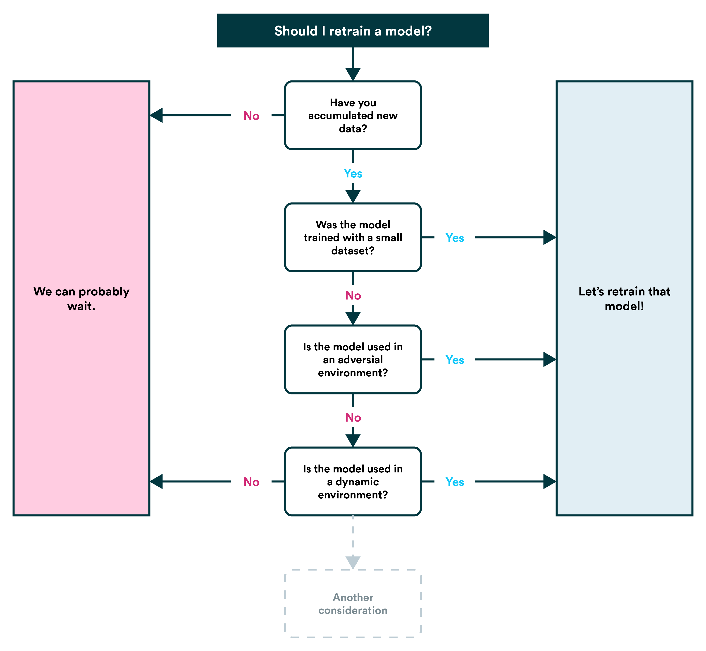

# MLOPS

工业部署模型需要掌握的相关知识

- data/model version: DVC
- feature store: feast
- model version: MLFlow

## 1. ML部署

场景: low latency high qps

### strategies

- Shadow deployment strategy
- A/B testing
- Multi Armed Bandit
- Blue-green deployment strategy
- Canary deployment strategy

### 应用工具
- tf-serving
  - 支持热部署，不会使服务失效

- flask
  - 压力测试 jmeter

- 模型
  - an end-to-end set
  - a confidence test set
  - a performance metric
  - its range of acceptable values

- Recovery

- Serving in Batch Mode

- 量化

- 高性能
  - C++重写inference，配上模型加速措施(剪枝，蒸馏，量化)，高并发请求

- LLM推理
  > fast-transformer, vllm等框架
  - attention: flash attention, paged attention
  - MOE

- gpu多实例部署

## 2. 模型压缩

- 蒸馏
  - 如何设计合适的学生模型和损失函数

- 量化
  - 减少每个参数和激活的位数（如32位浮点数转换为8位整数)，来压缩模型的大小和加速模型的运算

- 低秩分解近似

## 3. retrain
> develop a strategy to trigger model invalidations and retrain models when performance degrades.
> because of data drift, model bias, and explainability divergence

什么时候触发新的训练？
- amount of additional data becomes available
- model’s performance is degrading

## 4. Monitoring
- 模型性能: 准确性指标，延迟和吞吐性能
- 数据：drift
- 系统：资源使用情况
- 日志

## 5. 问答
- 模型部署后，怎么检测模型流量

## 参考
- [mlops-zoomcamp](https://github.com/DataTalksClub/mlops-zoomcamp)
- [Made With ML](https://madewithml.com/)
- [youtube-MLOps - Machine Learning Operations](https://www.youtube.com/playlist?list=PL3N9eeOlCrP5a6OA473MA4KnOXWnUyV_J)
- Machine Learning Engineering for Production (MLOps) Specialization
- [Version and track Azure Machine Learning datasets](https://learn.microsoft.com/en-us/azure/machine-learning/how-to-version-track-datasets?view=azureml-api-1)
- [Model Deployment Strategies](https://neptune.ai/blog/model-deployment-strategies)
- [ML Model Deployment Strategies](https://www.tensorops.ai/post/ml-model-deployment-strategies)
- [python实时语音识别服务部署 - 叫我小康的文章 - 知乎](https://zhuanlan.zhihu.com/p/467364921)
- [通用目标检测开源框架YOLOv6在美团的量化部署实战](https://tech.meituan.com/2022/09/22/yolov6-quantization-in-meituan.html)
- [炼丹师的工程修养之五：KubeFlow介绍和源码分析](https://zhuanlan.zhihu.com/p/98889237)
- 模型推理服务化框架Triton
- https://github.com/rapidsai/cloud-ml-examples
- [模型部署优化学习路线是什么？ - Leslie的回答 - 知乎](https://www.zhihu.com/question/411393222/answer/2359479242)
- [推荐系统线上Serving简介与C++代码实现 - Shard Zhang的文章 - 知乎](https://zhuanlan.zhihu.com/p/659652013)
- [使用TensorFlow C++ API构建线上预测服务 - 篇1](https://mathmach.com/6d246b32/)
