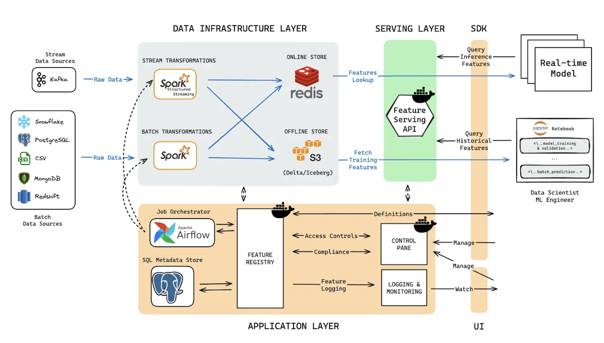

# 特征工程

> Using intuition to design **new features**, 基于业务理解 + 基于常用套路 + 基于EDA
> 
> 我个人喜欢基于类似[OOD设计](../03_system/01_ood/README.md)的ER图进行思考

- numerical feature
- categorical feature
- sparse feature
- dense feature
- time feature
- sequence feature
- graph feature

## 特征生成

## 特征选择

- correlation filtering

## Feature store

> 数据经过feature engineering pipeline之后进入feature store，feature store负责特征的**存储与serving**

## 问答

- high cardinality

## 参考

**精读**

- [特征工程到底是什么？ - 砍手豪的回答 - 知乎](https://www.zhihu.com/question/29316149/answer/2346832545)
- [Feature Engineering](https://www.slideshare.net/slideshow/feature-engineering-72376750/72376750)

**扩展**

- [刀功：谈推荐系统特征工程中的几个高级技巧 - 石塔西的文章 - 知乎](https://zhuanlan.zhihu.com/p/448680238)
- [Feature Store 101](https://medium.com/data-for-ai/feature-store-101-b964373891c4)
- [有哪些精彩的特征工程案例？ - 冯国添的回答 - 知乎](https://www.zhihu.com/question/400064722/answer/1911094226)

**代码**

- [https://github.com/senkin13/kaggle](https://github.com/senkin13/kaggle)
- [https://www.kaggle.com/code/fabiendaniel/elo-world](https://www.kaggle.com/code/fabiendaniel/elo-world)
