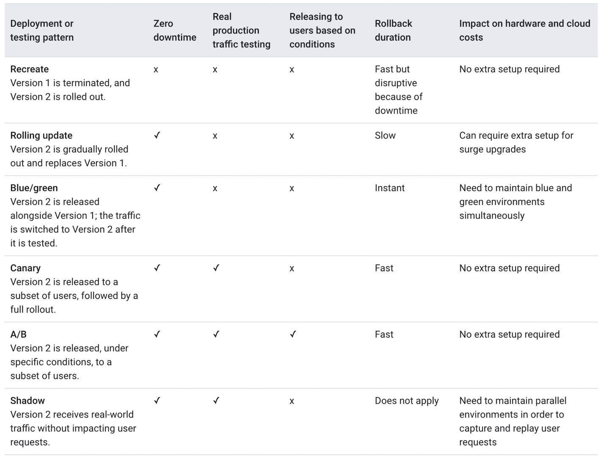

# MLOPS

MLops负责机器学习模型的自动化: CI/CD/CT，pipeline的orchestration和automation

- feature pipelines, training pipelines, and inference pipelines
- data/model version: DVC
- feature store: feast
- model version: MLFlow
- feature caching, data sharding, real-time feature aggregation and serving

## 1. ML部署

>- low latency 
>- high qps
>- throughput

### 1.1 strategies

- Shadow deployment strategy
- A/B testing
- Multi Armed Bandit
- Blue-green deployment strategy
- Canary deployment strategy

### 1.2 pipelines

- feature processing
  - batch serving: Apache Hive or Spark
  - real-time serving: Kafka, Flink, Spark Streaming

- Training pipeline
  - Scheduled Triggering: Apache Airflow, Kubeflow Pipelines
  - Event-Driven Triggering: AWS Lambda or Azure Functions can be set up to monitor certain metrics and trigger the training pipeline

- Inference pipeline
  - Batch Inference: Airflow or Kubernetes CronJobs
    - [Batch Inference at Scale with Amazon SageMaker](https://aws.amazon.com/blogs/architecture/batch-inference-at-scale-with-amazon-sagemaker/)
  - Real-Time Inference: Kafka, Flink, or an HTTP-based API (TensorFlow Serving, TorchServe)

### 1.2 工具
- [tf-serving](https://github.com/tensorflow/serving)
  - 支持热部署，不会使服务失效
  - TF-Serving 默认使用系统的内存分配器（如 glibc 的 malloc）。通过结合 TCMalloc，可以提升高并发场景下部署性能
- onnxruntime
  - I/O Binding: copy the data onto the GPU
- [kubeflow](https://github.com/kubeflow/examples/tree/master)
- [Flyte](https://github.com/flyteorg/flyte)
- [MLFlow](https://github.com/mlflow/mlflow)
- flask / fastapi / sanic
  - 压力测试 jmeter
- 模型
  - an end-to-end set
  - a confidence test set
  - a performance metric
  - its range of acceptable values
- Recovery

- 量化

- 高性能
  - C++重写inference，配上模型加速措施(剪枝，蒸馏，量化)，高并发请求

- LLM推理
  - GEMV 是大模型中的核心操作，其耗时主要源于巨大的计算量、频繁调用和硬件瓶颈
  - attention: flash attention, paged attention
  - MOE
  - vllm
    - paged attention/ continue batching
  - fast-transformer

- gpu多实例部署

## 2. 模型压缩

- 蒸馏
  - 如何设计合适的学生模型和损失函数

- 量化
  - 减少每个参数和激活的位数（如32位浮点数转换为8位整数)，来压缩模型的大小和加速模型的运算

- 低秩分解近似

- 剪枝 pruning

## 3. retrain
> - develop a strategy to trigger model invalidations and retrain models when performance degrades.
> - because of data drift, model bias, and explainability divergence

什么时候触发新的训练？
- amount of additional data becomes available
- model’s performance is degrading

## 4. Monitoring
- 模型性能: 准确性指标，延迟和吞吐性能
- 数据：drift
- 系统：资源使用情况
- 日志

## 5. 问答
- 模型部署后，怎么检测模型流量: 日志记录
- 如何将决策树模型部署在1000台机器上
  - 模型序列化: JSON、Pickle 或 Protobuf
  - 微服务架构
    - Flask / FastAPI: 轻量级服务
    - gRPC：高效的远程过程调用框架，适合需要高性能和低延迟的场景
    - Kubernetes: 大规模管理微服务实例
  - 容器化服务
  - 使用 Kubernetes 进行管理
  - 负载均衡和流量管理
  - 监控和日志管理
    - Prometheus 和 Grafana 监控微服务的性能指标
    - Elasticsearch、Fluentd 和 Kibana (EFK, 分别对应日志的索引、日志的采集、日志的展示与分析三个维度)
  - 客户端请求
- 工具
  - AWS Terraform: 用户可以用代码定义 AWS 资源（如 EC2 实例、S3 存储桶、RDS 数据库等），并自动化其创建、更新和删除
  - AWS sagemaker
  - AWS lambda
  - MLflow, DVC, Neptune, or Weights & Biases

## 参考
- [https://mlip-cmu.github.io/s2025/](https://mlip-cmu.github.io/s2025/)
- [Open-source Workflow Management Tools: A Survey](https://ploomber.io/blog/survey/#ploomber)
- [Global MLOps and ML tools landscape](https://www.mlreef.com/blog/global-mlops-and-ml-tools-landscape)
- [mlops-zoomcamp](https://github.com/DataTalksClub/mlops-zoomcamp)
- [Made With ML](https://madewithml.com/)
- [ml-engineering](https://github.com/stas00/ml-engineering/)
- [youtube-MLOps - Machine Learning Operations](https://www.youtube.com/playlist?list=PL3N9eeOlCrP5a6OA473MA4KnOXWnUyV_J)
- Machine Learning Engineering for Production (MLOps) Specialization
- [Version and track Azure Machine Learning datasets](https://learn.microsoft.com/en-us/azure/machine-learning/how-to-version-track-datasets?view=azureml-api-1)
- [Model Deployment Strategies](https://neptune.ai/blog/model-deployment-strategies)
- [ML Model Deployment Strategies](https://www.tensorops.ai/post/ml-model-deployment-strategies)
- [python实时语音识别服务部署 - 叫我小康的文章 - 知乎](https://zhuanlan.zhihu.com/p/467364921)
- [通用目标检测开源框架YOLOv6在美团的量化部署实战](https://tech.meituan.com/2022/09/22/yolov6-quantization-in-meituan.html)
- [炼丹师的工程修养之五：KubeFlow介绍和源码分析](https://zhuanlan.zhihu.com/p/98889237)
- 模型推理服务化框架Triton
- [https://github.com/rapidsai/cloud-ml-examples](https://github.com/rapidsai/cloud-ml-examples)
- [模型部署优化学习路线是什么？ - Leslie的回答 - 知乎](https://www.zhihu.com/question/411393222/answer/2359479242)
- [推荐系统线上Serving简介与C++代码实现 - Shard Zhang的文章 - 知乎](https://zhuanlan.zhihu.com/p/659652013)
- [使用TensorFlow C++ API构建线上预测服务 - 篇1](https://mathmach.com/6d246b32/)
- [https://github.com/cortexlabs/cortex](https://github.com/cortexlabs/cortex)
- [https://github.com/ivanpanshin/flask_gunicorn_nginx_docker](https://github.com/ivanpanshin/flask_gunicorn_nginx_docker)
- [ml-pipeline-with-airflow-docker-operator](https://github.com/coder2j/ml-pipeline-with-airflow-docker-operator)
- [Accessible Machine Learning through Data Workflow Management](https://www.uber.com/en-SG/blog/machine-learning-data-workflow-management/)
- [了解/从事机器学习/深度学习系统相关的研究需要什么样的知识结构？ - 张睿的回答 - 知乎](https://www.zhihu.com/question/315611053/answer/2288506497)
- https://github.com/logicalclocks/hopsworks-tutorials
- https://github.com/iusztinpaul/energy-forecasting
- https://github.com/cmunch1/nba-prediction
- https://github.com/MatejFrnka/ScalableML-project
- [Scaling Apache Airflow for Machine Learning Workflows](https://valohai.com/blog/scaling-airflow-machine-learning/)
- [外卖广告大规模深度学习模型工程实践](https://tech.meituan.com/2022/07/06/largescaledeeplearningmodel-engineeringpractice-in-mtwaimaiad.html)
- [微信基于 PyTorch 的大规模推荐系统训练实践 - DataFunTalk的文章 - 知乎](https://zhuanlan.zhihu.com/p/619060815)
- [AIOps在美团的探索与实践——事件管理篇](https://tech.meituan.com/2023/12/22/aiops-based-incident-management.html)
- [TFX: Real World Machine Learning in Production](https://cdn.oreillystatic.com/en/assets/1/event/298/TFX_%20Production%20ML%20pipelines%20with%20TensorFlow%20Presentation.pdf)
- https://www.youtube.com/playlist?list=PL3N9eeOlCrP5a6OA473MA4KnOXWnUyV_J
- https://fullstackdeeplearning.com/course/2022/
- https://github.com/visenger/awesome-mlops
- [From MLOps to ML Systems with Feature/Training/Inference Pipelines](https://www.hopsworks.ai/post/mlops-to-ml-systems-with-fti-pipelines)
