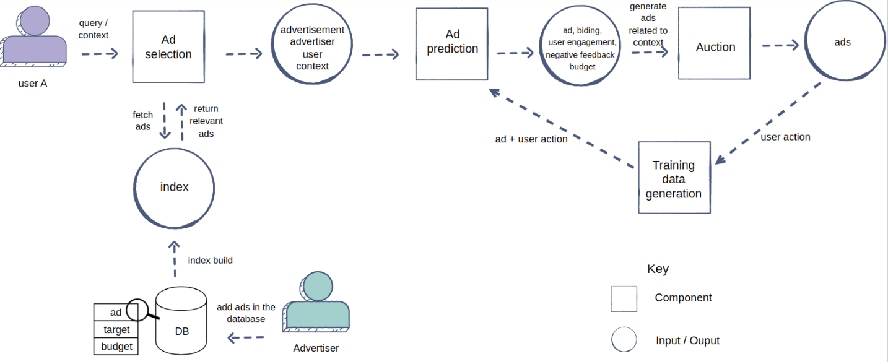
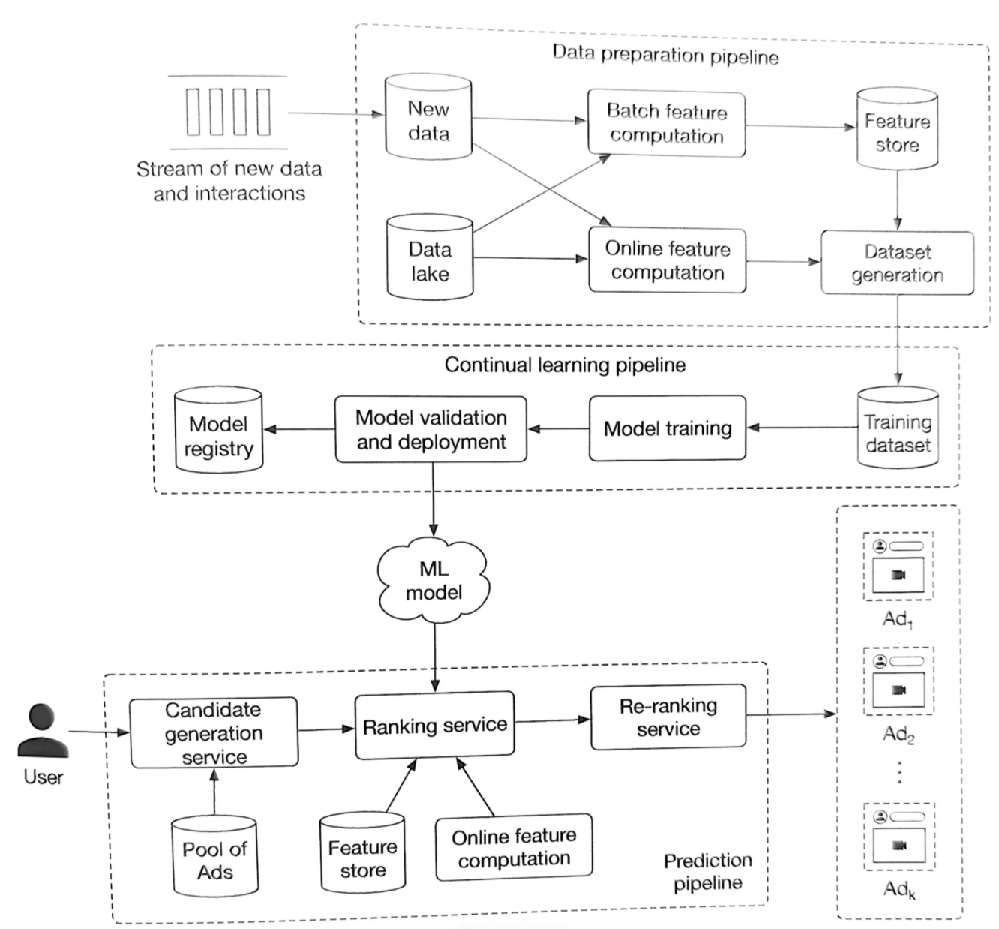
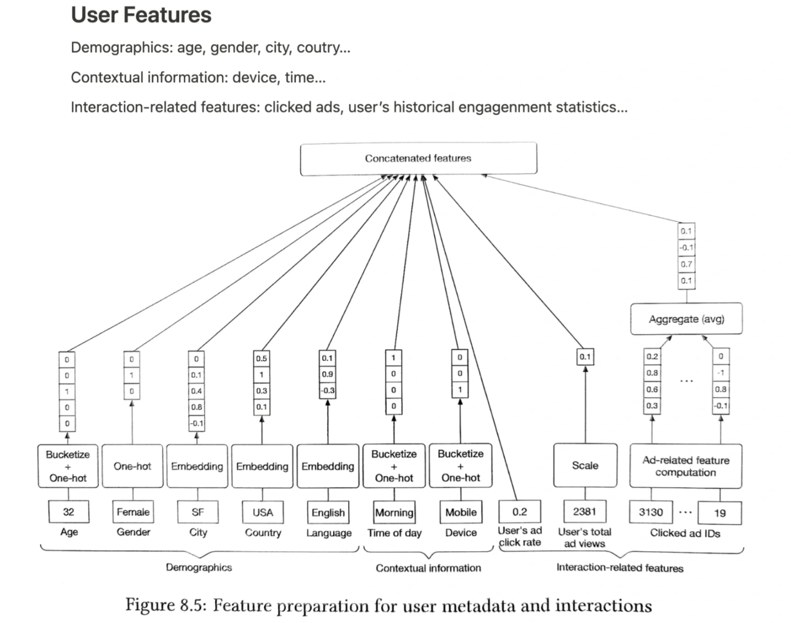
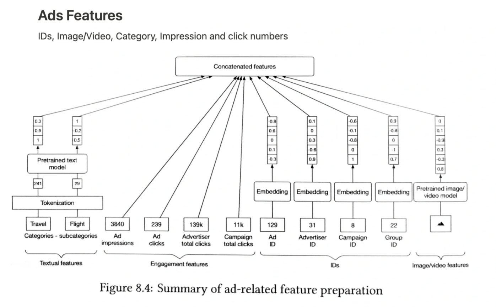

# Design ad click prediction system

广告系统是广告与用户流量的匹配。
- 定向，粗排，精排，检索，bidding，新广告，中长尾广告，排期，保量，波动分析，多广告位拍卖，DPA，素材优化，自动化审核，用户择优
- 转化漏斗：曝光 —> 点击 —> 转化

## 1. requirement

**场景类**
- We have a bidding server which makes bids and produces logs. Also we have information about impressions and conversions (usually with some delays). We want to have a model which using this data will predict a probability of click (conversion)
- What is the primary business objective of the click prediction system?
- What types of ads are we predicting clicks for (e.g., display ads, video ads, sponsored content)?
- Are there specific user segments or contexts we should consider (e.g., user demographics, browsing history)?
- How will we define and measure the success of click predictions (e.g., click-through rate, conversion rate)?
- Do we have negative feedback features (such as hide ad, block, etc)?
- Do we have fatigue period (where ad is no longer shown to the users where there is no interest, for X days)?
- What type of user-ad interaction data do we have access to can we use it for training our models?
- Do we need continual training?
- How do we collect negative samples? (not clicked, negative feedback).

**功能类**
- personalization
- diversity, 不能把相似广告放一起
- explicit negative feedback, multi-task ranking增加一个head, label是hide block

**非功能**
- scale
- latency

## 2. ML task & pipeline

- 召回(match/retrieval)：流量访问时，从可选的广告库全集中，筛选合适的广告候选子集
- 排序(rank)：对于给定的广告候选子集，给出相应的预估值。
- 策略(bidding&strategy)：根据预估值，通过控制广告的出价、排序公式等，影响流量的最终分配

业务过程：
1. advertiser create ads
2. ads indexing (inverted index, we can use elastic search)
   - 如何减少广告索引的latency，inverted index + db replica + cache
3. users search for certain keywords
4. recall
5. ranking

## 3. data collection

Data Sources
- Users
- Ads
- User-ad interaction
ML Data types
Labelling

## 4. feature

It is important for CTR prediction to learn implicit feature interactions behind user click behaviors.

## 5. model

广告算法主流模型. 广告算法基本都是point wise训练方式，因为广告是很少以列表的形式连续呈现
- Logistic regression (feature crossing)
- GBDT
- GBDT+LR
- NN
- Deep and Cross Network
- FM (FFM)
- DeepFM
- DIN (DIEN)
- DSSM双塔模型
- ESSM
- Wide and Deep

uplift: 预测增量值(lift的部分), 预测某种干预对于个体状态或行为的因果效应(识别营销敏感人群)。
$$ Lift = P(buy|treatment) - P(buy|no treatment) $$

## 6. evaluation
**Offline metrics**
- Log Loss

**Online metrics**
- Overall revenue (or ROI)
- Spend

## 7. deployment & serving
- A/B testing

## 8. monitoring & maintenance

## 问答

- bad ads
  - 侧重解决数据来源(人工标注), 以及数据量比较小的问题
  - LLM fine tune teacher, teacher做bulk inference, distill到student
- calibration:
  - fine-tuning predicted probabilities to align them with actual click probabilities
- data leakage:
  - info from the test or eval dataset influences the training process
  - target leakage, data contamination (from test to train set)
- catastrophic forgetting
  - model trained on new data loses its ability to perform well on previously learned tasks
- [Realtime Advertisement Clicks Aggregator](https://www.youtube.com/watch?v=_b6FniEjiR4)
- gdpr、dma这些rule对广告的影响

## reference
- [Unpacking How Ad Ranking Works at Pinterest](https://www.infoq.com/articles/pinterest-ad-ranking-ai/?topicPageSponsorship=ed11260b-6513-40ba-922f-aae7ac9f942c)

扩展
- [On the Factory Floor: ML Engineering for Industrial-Scale Ads Recommendation Models](https://arxiv.org/abs/2209.05310)
- [snap: Machine Learning for Snapchat Ad Ranking](https://eng.snap.com/machine-learning-snap-ad-ranking)
- [架构设计之广告系统架构解密](https://zhuanlan.zhihu.com/p/300167370)
- [How ads indexing works at Pinterest](https://medium.com/pinterest-engineering/how-ads-indexing-works-at-pinterest-99b4796f289f)
- [互联网广告系统：架构、算法与智能化](https://mp.weixin.qq.com/s/OpaHZc8ZYEH4TXCu65pVOQ)
- [Design an evaluation framework for ads ranking](https://www.tryexponent.com/questions/3095/design-an-evaluation-framework-for-ads-ranking)
- [uplift: 一文读懂增益模型Uplift Model](https://zhuanlan.zhihu.com/p/599355166)
- [github.com/alirezadir/Machine-Learning-Interviews/blob/main/src/MLSD/mlsd-ads-ranking.md](https://github.com/alirezadir/Machine-Learning-Interviews/blob/main/src/MLSD/mlsd-ads-ranking.md)
- [Amazon Ads Architecture at Scale - ReInvent 2021](https://www.youtube.com/watch?v=YRbIAmzFxxc)
- [pinterest: Building a real-time user action counting system for ads](https://medium.com/pinterest-engineering/building-a-real-time-user-action-counting-system-for-ads-88a60d9c9a)
- [Ad Click Prediction | Machine learning system design](https://medium.com/@mumbaiyachori/ad-click-prediction-machine-learning-system-design-6e553d7ccc1c)
- [广告和推荐在召回候选集时的区别？ - 武侠超人的回答 - 知乎](https://www.zhihu.com/question/56781383/answer/3069396264)
- [计算广告与推荐系统有哪些区别？ - 刍狗的回答 - 知乎](https://www.zhihu.com/question/19662693/answer/3547885313)
- [推荐算法岗是否存在严重人才过剩? - 程序员老刘的回答 - 知乎](https://www.zhihu.com/question/320805246/answer/2735102802)
- [广告推荐系统中的商品冷启动实践 - 丹丹的文章 - 知乎](https://zhuanlan.zhihu.com/p/704979435)
