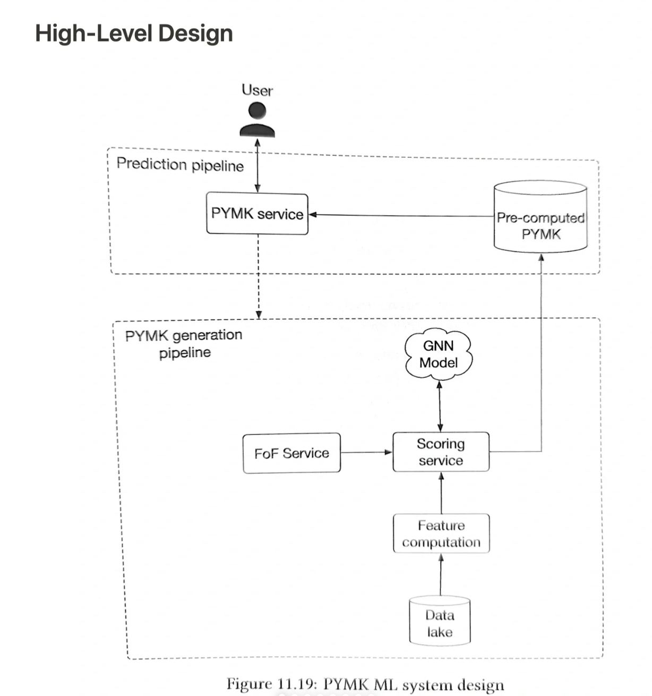
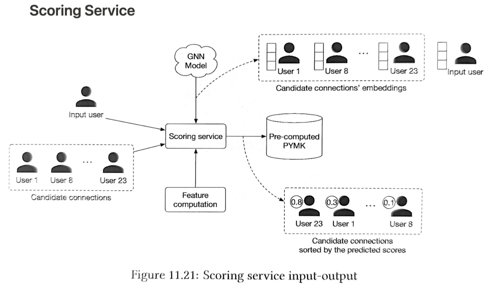

# 可能认识的人推荐

u2u推荐

## 1. requirements
**场景/产品**
- friendship is symmetrical

**目标**
- help users discover potential connections and grow their network

**约束**
- the total number of users on the platform
- daily active users
- average connections for one user

## 2. ML task & pipeline
- 利用共同好友、位置、教育背景、工作经历判断可能认识
- 输入用户信息，输出和该用户最相似的k个用户作为推荐

## 3. data

## 4. feature
user

- 共同好友个数

## 5. model

**ranking**

point-wise learning to rank
- task 2 users as input, output the probability of forming a friend

graph based prediction
- graph level prediction
  - predict if a chemical compound us an enzyme
- node level prediction
  - predict if a specific user is a spammer
- edge level prediction
  - predict if two users likely to connect

## 6. evaluation

## 7. deployment & serving
- 部分 batch serving

## 8. monitoring & maintenance

## reference
- [大规模异构图召回在美团到店推荐广告的应用](https://tech.meituan.com/2022/11/24/application-of-large-scale-heterogeneous-graph-in-meituan-recommended-ads.html)
- [推荐系统u2u算法简介 - Shard Zhang的文章 - 知乎](https://zhuanlan.zhihu.com/p/665867589)
- [people you may know](https://webupon.com/blog/linkedin-people-you-may-know-algorithm/)
