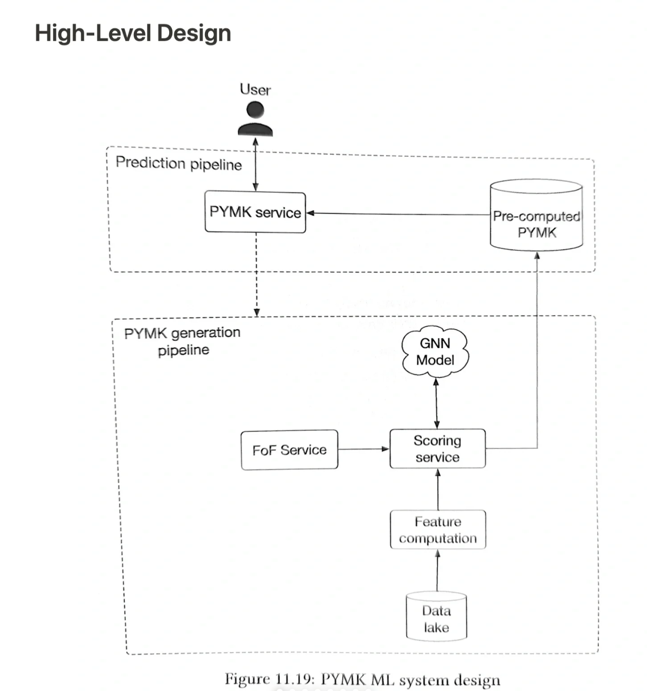
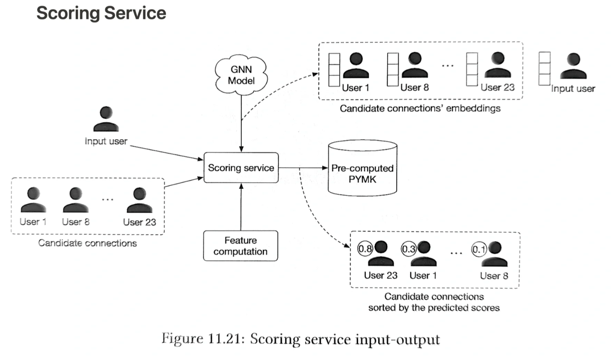

# 可能认识的人推荐

u2u推荐

## 1. requirements

## 2. metrics

## 3. pipeline

## 4. data collection

## 5. feature

## 6. model

**ranking**

point-wise learning to rank
- task 2 users as input, output the probability of forming a friend

graph based prediction
- graph level prediction
  - predict if a chemical compound us an enzyme
- node level prediction
  - predict if a specific user is a spammer
- edge level prediction
  - predict if two users likely to connect

## reference
- [大规模异构图召回在美团到店推荐广告的应用](https://tech.meituan.com/2022/11/24/application-of-large-scale-heterogeneous-graph-in-meituan-recommended-ads.html)
- 
