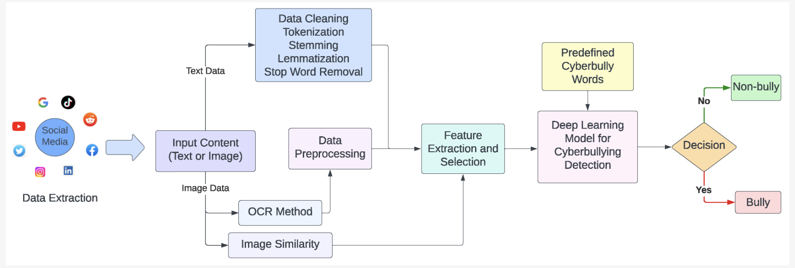
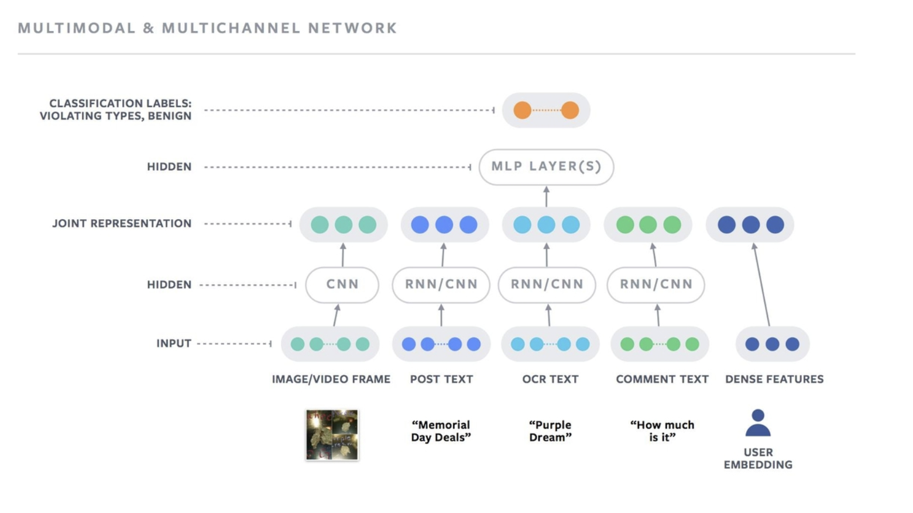
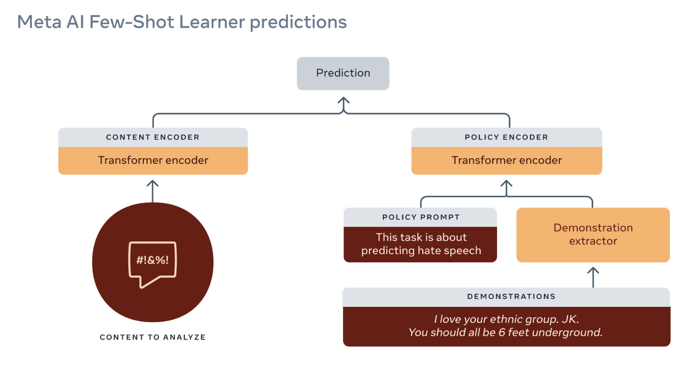

# Harmful content detection
harmful content/weapon ads, copyright检测

> 内容风控: 多模态场景, evolve rapidly

## 1. requirements

**场景/功能**
- product
- item
  - What types of harmful content are we aiming to detect? (e.g., hate speech, explicit images, cyberbullying)?
  - What are the potential sources of harmful content? (e.g., social media, user-generated content), detect bad actors?
  - Are there specific legal or ethical considerations for content moderation

**目标**
- more accuracy or recall

**约束**
- What is the expected volume of content to be analyzed daily?
- Are there human annotators available for labeling?
- Is there a feature for users to report harmful content? (click, text, etc).
- Is explainability important here?
- 是否有必要检测出harmful的具体类型? (violence, nudity, self-harm, hate speech) -> multi-task
- latency requirement

## 2. pipeline
- 先介绍几个大的方向, pros, cons
- Multimodal input (text, image, video, speech, etc)
- Multi-Label/Multi-Task classification

## 3. data collection
本题中，如何收集数据和label是比较关键的。可以先确认有没有annotated data，没有的话则先根据用户反馈(silver labels)，再根据人工审核(golden labels). 或者利用大模型进行合成或判断

- platform: 人工审核
- user feedback: report，dislike，comment, surfaced by user complaints
- interaction: anomaly

## 4. feature

- item
  - text
  - image/video
  - audio
- user
  - author
- interaction
  - engagement
  - report
- context

## 5. model

- 多模态(few-shot, 或微调)
- 大模型
- 多任务
  - 可以提升任务之间的信息共享，二是在线预估时相比多个单任务模型也能节省性能

## 6. evaluation

- offline
  - F1 score, PR-AUC, ROC-AUC
  - 为什么我们选择auc-pr而不是auc-roc。因为auc-pr可以更好的处理imbalance data, harmful content本身就是少数
- online
  - AB test evaluated by online metric.
  - prevalence (percentage of harmful posts didn't prevent over all posts), harmful impressions, percentage of valid (reversed) appeals, proactive rate (ratio of system detected over system + user detected)
  - 很多场景，不是知道所有错误信息的(spam/fraud detection)。比较简单的方法，就是不做true recall. sample一些data做个partial recall, 还可以看自己业务设置其他类似recall的matrix

## 7. deployment and prediction service

- 有些环节offline, 有些online, serving就是online部分
- Harmful content detection service
- Demoting service (prob of harm with low confidence)
- violation service (prob of harm with high confidence)

## 8. monitoring and maintenance

- 怎么部署这个系统，后续如何维护
- How to roll out new model? AB test: 10% as holdout, others as factorial experiment design. 同一个factor内的level互斥, 不同factor之间正交. significant improvement 就可以推全, 留一小部分做reverse AB.

## Reference
- [Harmful content can evolve quickly. Our new AI system adapts to tackle it.](https://ai.meta.com/blog/harmful-content-can-evolve-quickly-our-new-ai-system-adapts-to-tackle-it/)
- [soft404 detection](https://github.com/internetarchive/tarb_soft404)
- [How Pinterest fights misinformation, hate speech, and self-harm content with machine learning](https://medium.com/pinterest-engineering/how-pinterest-fights-misinformation-hate-speech-and-self-harm-content-with-machine-learning-1806b73b40ef)
- [How Facebook uses super-efficient AI models to detect hate speech](https://ai.meta.com/blog/how-facebook-uses-super-efficient-ai-models-to-detect-hate-speech/)
- [Detecting and preventing abuse on LinkedIn using isolation forests](https://www.linkedin.com/blog/engineering/data-management/isolation-forest)
- [https://www.youtube.com/watch?v=fVOEYvquKBI](https://www.youtube.com/watch?v=fVOEYvquKBI)
- [How our content abuse defense systems work to keep members safe](https://www.linkedin.com/blog/engineering/trust-and-safety/how-our-content-abuse-defense-systems-work-to-keep-members-safe)
- [DETECTING HARMFUL CONTENT ON ONLINE PLATFORMS: WHAT PLATFORMS NEED VS. WHERE RESEARCH EFFORTS GO](https://arxiv.org/pdf/2103.00153)
- [https://github.com/alipay/YiJian-Community](https://github.com/alipay/YiJian-Community)
- [Generative AI: Shaping a New Future for Fraud Prevention](https://www.infoq.com/articles/generative-ai-fraud-prevention/?topicPageSponsorship=ed11260b-6513-40ba-922f-aae7ac9f942c)