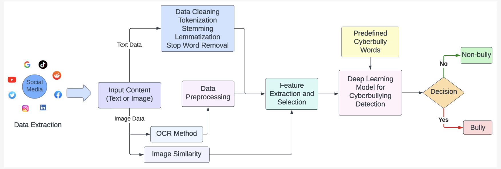

# Harmful content detection

## 1. requirements
- What types of harmful content are we aiming to detect? (e.g., hate speech, explicit images, cyberbullying)?
- What are the potential sources of harmful content? (e.g., social media, user-generated content platforms)
- Are there specific legal or ethical considerations for content moderation
- What is the expected volume of content to be analyzed daily?
- What are supported languages?
- Are there human annotators available for labeling?
- Is there a feature for users to report harmful content? (click, text, etc).
- Is explainability important here?

## 2. metrics
- offline
  - F1 score, PR-AUC, ROC-AUC
- online
  - prevalence (percentage of harmful posts didn't prevent over all posts), harmful impressions, percentage of valid (reversed) appeals, proactive rate (ratio of system detected over system + user detected)
  - 很多场景，不是知道所有错误信息的(spam/fraud detection)。比较简单的方法，就是不做true recall. sample一些data做个partial recall, 还可以看自己业务设置其他类似recall的matrix

## 3. pipeline
- Multimodal input (text, image, video, speech, etc)
- Multi-Label/Multi-Task classification

## 4. data collection

- user
- item
- interaction

## 5. feature

- item
  - text
  - image/video
- user
- interaction
- context

## 6. model

- NN

## 7. prediction service

- Harmful content detection service
- Demoting service (prob of harm with low confidence)
- violation service (prob of harm with high confidence)

## 8. maintain

- 怎么部署这个系统，后续如何维护

## Reference
- [soft404 detection](https://github.com/internetarchive/tarb_soft404)
- [How Pinterest fights misinformation, hate speech, and self-harm content with machine learning](https://medium.com/pinterest-engineering/how-pinterest-fights-misinformation-hate-speech-and-self-harm-content-with-machine-learning-1806b73b40ef)
- [How Facebook uses super-efficient AI models to detect hate speech](https://ai.meta.com/blog/how-facebook-uses-super-efficient-ai-models-to-detect-hate-speech/)
- [Detecting and preventing abuse on LinkedIn using isolation forests](https://www.linkedin.com/blog/engineering/data-management/isolation-forest)
