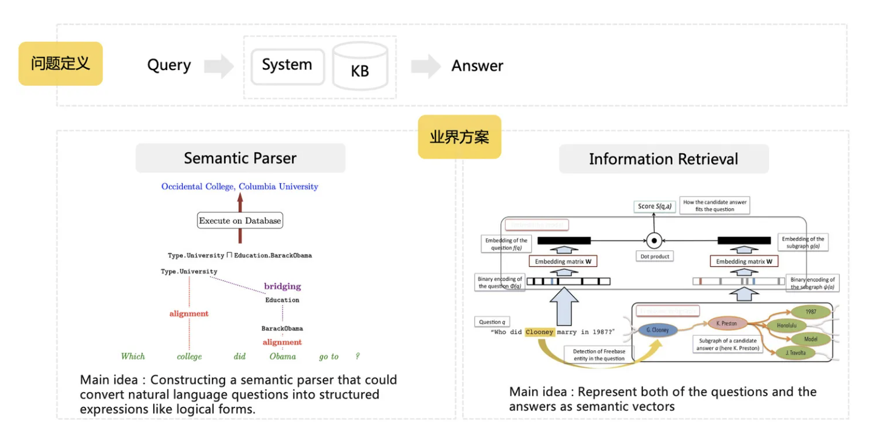
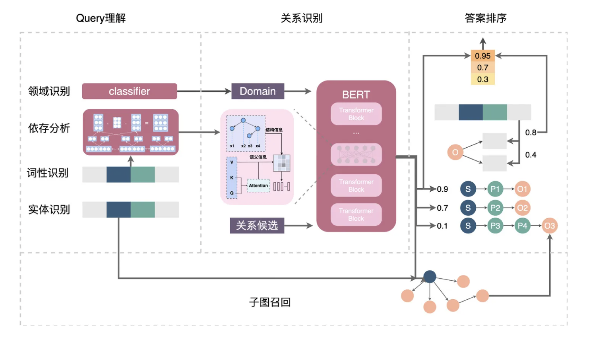

# 知识图谱问答

## 1. requirements

## 2. ML task & pipeline

## 3. data collection

## 4. feature

## 5. model

## 6. evaluation

## 7. deployment & serving

## 8. monitor & maintenance

## reference
- [https://github.com/shawnh2/QA-CivilAviationKG](https://github.com/shawnh2/QA-CivilAviationKG)
- [美团知识图谱问答技术实践与探索](https://tech.meituan.com/2021/11/03/knowledge-based-question-answering-in-meituan.html)
- [检索式对话系统在美团客服场景的探索与实践](https://tech.meituan.com/2022/11/03/retrieval-based-dialogue-system.html)
- [阿里小蜜：知识结构化推动智能客服升级](https://mp.weixin.qq.com/s/x9CkAyLKgLj7E7K1F2Q6iA)
- [阿里实时语音与智能对话](https://mp.weixin.qq.com/s/scvTTqApSr8SbCKRlUoz-g)
- [智能机器人在滴滴出行场景的技术探索](https://mp.weixin.qq.com/s/MSy8OHzR3avObmOq9uSSFQ)
- [QQ浏览器智能问答技术探索实践](https://mp.weixin.qq.com/s/nN0aSXQN_IyjIJ1mRT5s3w)
- [达摩院基于元学习的对话系统](https://mp.weixin.qq.com/s/Ji_-hTe5vwpnyu-whj3PXg)
- [大话知识图谱-意图识别和槽位填充](https://zhuanlan.zhihu.com/p/165963264)
- 