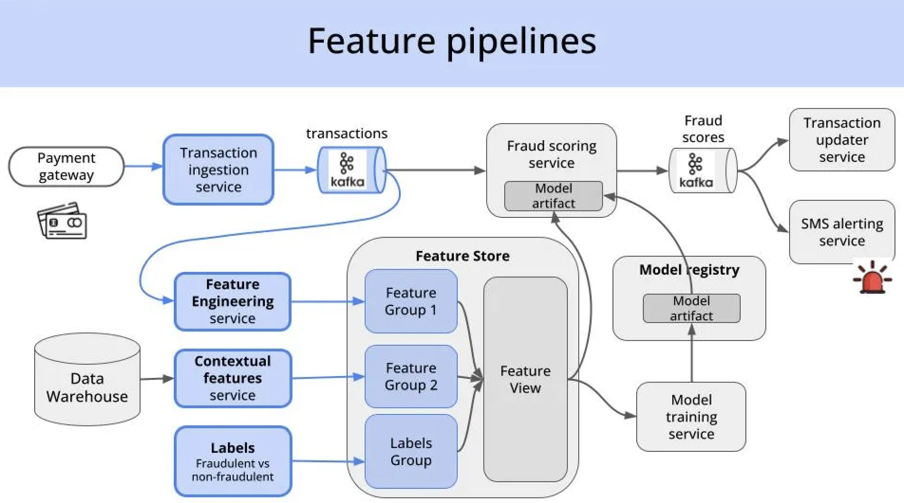
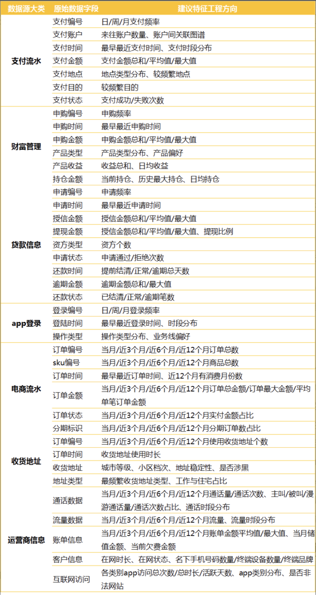
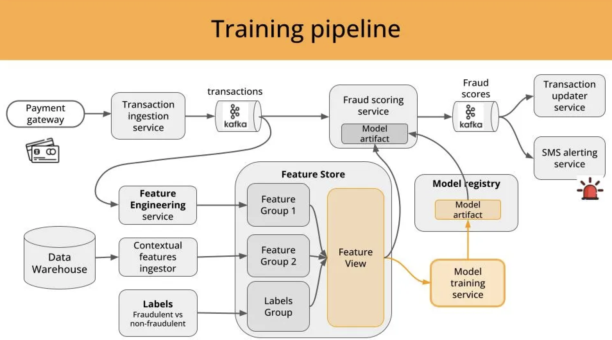
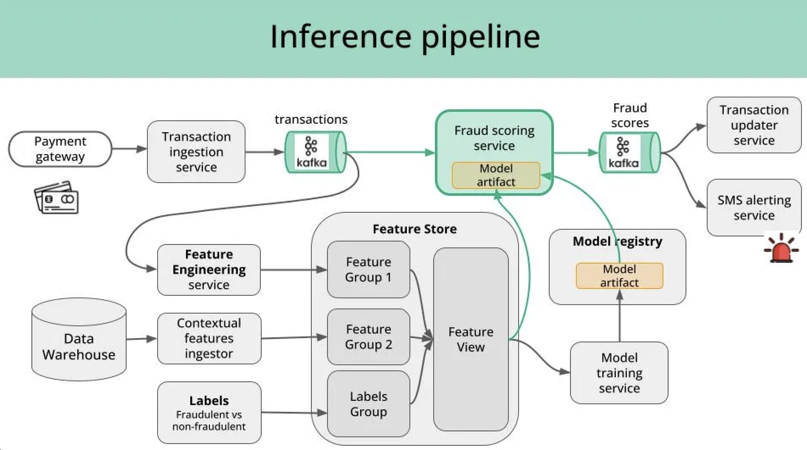

# Loan origination system

> Design an end-to-end machine learning system for a real-time loan approval/rejection model, such as credit cards. Discuss the infrastructure, features, model, training and evaluation aspects of the system.

## 1. requirements

**functional**

- stage: 获客、贷前(Loan origination)、贷中(Loan maintenance /servicing)、贷后(Delinquency management/recovery)
- types of loans it will support
- types of risk it will support -> 决定了是一个什么样的机器学习任务, 影响难点
- 目标: 识别优劣(风险，需求，价值)
  - 业务指标

**non-functional**

- compliance requirements
- scalability goals
- reliability, security

## 2. ML task & pipeline & keys

信贷风控决策流
黑白名单
rule + model
binary classification, multi class classification or multi label classification

## 3. data

- user (关系型数据库)
  - credit 信用
  - fraud 欺诈
- log (分布式文件系统)
- label
  - 滚动率(Roll Rate)、vintage
  - 从数据指标中发现风险点
  - 信贷: 逾期不放贷款的就是黑样本

需求类:
履约风险:
履约能力:

外部数据

- 因合规要求，很多互联网大数据只能从征信平台以评分的形式引入

## 4. feature

> feature engineering is the art

> 

**user**

- ID/Address Proof: Voter ID, Aadhaar, PAN Card
- Employment Information, including salary slips
- Credit Score
- Bank Statements and Previous Loan Statements
- 反欺诈重要feature，如ip，device_id，idfv，phone number

---

- graph
- 行为序列
- compliance -> buy some user feature

## 5.model

> 解释性

- Credit Scoring Models 评分卡
- LR
- GBDT
- NN
- Probabilistic Calibration

## 6. evaluation

- offline
  - 准确率、AUC、Log Loss、Precision、Recall
  - Kolmogorov-Smirnov，风控常用指标

## 7. deploy & serving

- feature service
- prediction service

## 8. monitoring & maintenance

- Approval Rate

## 9. QA & optimization

- cold start
- profit/revenue come from which (credit score) part of customers, risk come from which part of customers

## reference

- [外部数据在信贷风控和经营中的应用](https://mp.weixin.qq.com/s/bJGFsIuNVNfg1866PQ9gYg)
- [Real Time Risk Management and Assessment](https://www.gigaspaces.com/blog/real-time-risk-management)
- [How Loan Management Software Improves Loan Risk Assessment For Lenders](https://lendfusion.com/blog/loan-risk-assessment/)
- [我现在来演示一下风控模型的架构 - 风控少侠的文章 - 知乎](https://zhuanlan.zhihu.com/p/717674909)
- [风控架构简单分享 - 回首乱山横的文章 - 知乎](https://zhuanlan.zhihu.com/p/683754431)
- [特征工程到底是什么？](https://www.zhihu.com/question/29316149)
- [风控模型—区分度评估指标(KS)深入理解应用 - 求是汪在路上的文章 - 知乎](https://zhuanlan.zhihu.com/p/79934510)
- [小样本学习在滴滴治理和安全场景应用](https://mp.weixin.qq.com/s/sf5B0hmhwIoYLuCU7Rdvug)
- [复杂风控场景下，如何打造一款高效的规则引擎](https://tech.meituan.com/2020/05/14/meituan-security-zeus.html)
- [Build and Deploy a Real Time ML System](https://paulabartabajo.substack.com/p/implementing-a-real-time-ml-system)
- [Let's build another Real Time ML System](https://www.realworldml.net/blog/let-s-build-a-real-time-ml-system-2)
