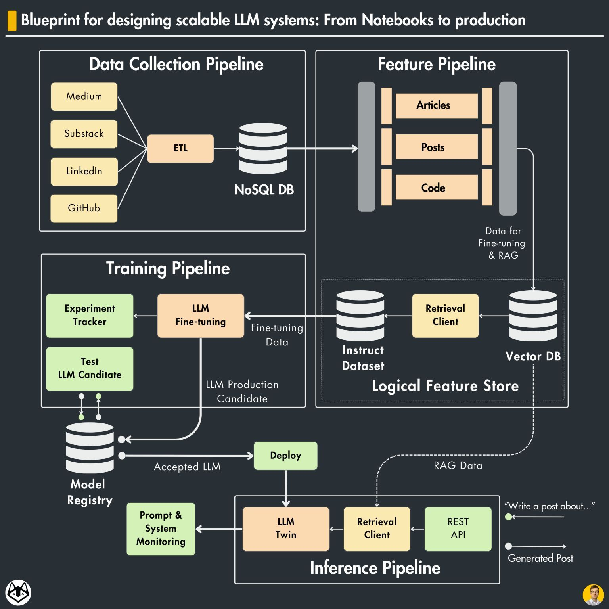

# RAG

大模型相关系统设计可参考[Microsoft graphRAG](https://github.com/microsoft/graphrag)，[Google notebookLM](https://notebooklm.google/?location=unsupported)，deep research

## 1. requirements

> freshness considered as correct answer may change over time

**use case**

- scope, product customer
- agent功能
- 多轮 multi turn follow-up
- 是否提供reference
- personalization

**constraint**

- latency
- Throughput
- Availability
- Scalability

**知识库**

- Is the data structured (e.g., databases, knowledge graphs) or unstructured (e.g., text documents, web pages)?
- Volume: How large is the knowledge base?
- Velocity: How frequently does the knowledge base change?
- Veracity: How reliable and trustworthy is the information?

**大模型推理**

- TTFT (Time to first token)
- TBT (Time between tokens)
- Throughput

## 2. ML task & pipeline

- indexing
- retrieval
  - 与[search技术](./search_engine.md)类似
- generation

**optional**

- rewrite
- routing
- 人工审批流程
- memory
- fusion
- multimodal
- Long context

## 3. data

- document chunk
- data augmentation (e.g. query expansion)
- query rewrite

## 4. model

**retrieval**

- hybrid
- finetuning loss
- finetuning dataset prepare

**llm**

- finetuning
- prompt engineering

## 5. evaluation

**retrieval**

- mrr, ndcg
- relevance, coherence(连贯性)

**generation**

- rouge-l, 关键词重合度
- 主观评估：质量，准确性

**online**

- AB testing
- useful/truthful

## 6. deploy & service

- Tracing
  - 记录和监控各个组件的调用、性能、输入输出等。识别瓶颈、调试问题，并优化性能
- KV cache

## 7. monitoring & maintenance

## 8. 优化与问答

- NL2SQL
- 幻觉
  - [Chain-of-Verification](https://arxiv.org/abs/2309.11495)
- 如何单独更新知识库中某个文档？
  - 增量更新, 给文档添加版本号
- 多轮对话的RAG如何实现
  - 历史记录重写查询: 基于多轮的会话记录与当前问题，调用大模型生成一个新问题. llamaindex提供了CondenseQuestionChatEngine, ContextChatEngine
  - memory 模块
- 召回结果中有相互排斥的信息

## Reference

- [https://github.com/langchain-ai/rag-from-scratch](https://github.com/langchain-ai/rag-from-scratch)
- [Better RAG 1: Advanced Basics](https://huggingface.co/blog/hrishioa/retrieval-augmented-generation-1-basics)
- [https://github.com/langgenius/dify](https://github.com/langgenius/dify)
- [Mock_ML_System_Design_RAG_Chat_With_Doc_Versions](https://github.com/ML-SystemDesign/MLSystemDesign/tree/main/Design_Doc_Examples/Mock_ML_System_Design_RAG_Chat_With_Doc_Versions)
- [Building RAG-based LLM Applications for Production](https://www.anyscale.com/blog/a-comprehensive-guide-for-building-rag-based-llm-applications-part-1)
- [Building a RAG Batch Inference Pipeline with Anyscale and Union](https://www.anyscale.com/blog/anyscale-union-batch-inference-pipeline)
- [Creating a Modern OCR Pipeline Using Computer Vision and Deep Learning](https://dropbox.tech/machine-learning/creating-a-modern-ocr-pipeline-using-computer-vision-and-deep-learning)
- [How we built Text-to-SQL at Pinterest](https://medium.com/pinterest-engineering/how-we-built-text-to-sql-at-pinterest-30bad30dabff)
