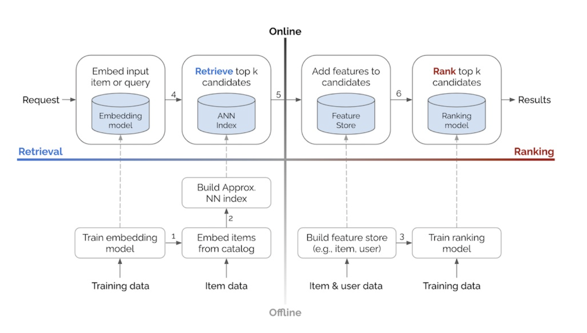
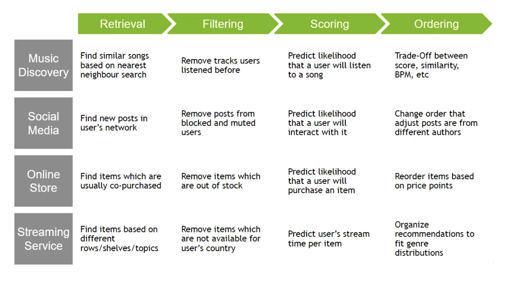
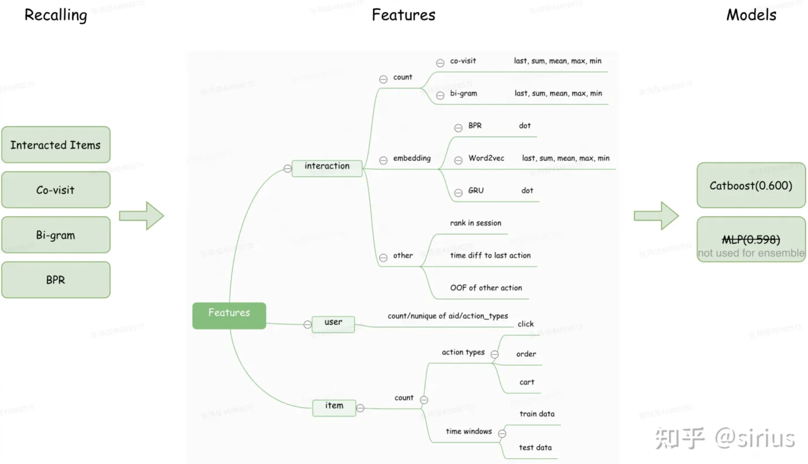

# 推荐系统设计

配合[推荐系统理论](../../02_ml/17_recommendation.md)

**名词解释**
- 曝光(impression): 文档被用户看到
- 点击率(click-through-rate，CTR): 文档d曝光的前提下，用户点击d的概率
- 交互行为(engagement): 在点击的前提下, 文档的点赞、收藏、转发、关注作者、评论。电商的加购物车、下单、付款

推荐系统的重要性源自**信息过载**与**人们行为的长尾分布**. 目的是Link user with items in a reasonable way.
- 长尾/热门
  - 头部用户精细刻画，准确记忆；占比更大的稀疏长尾，需要很好地泛化
- 记忆/探索
- 稀疏/embedding

推荐系统是经典的机器学习系统设计题目，注意把各个环节串联起来，形成框架性思考。
例如大规模推荐，为什么需要召回加排序的漏斗结构？是因为召回能**快速**把大规模candidate显著减小，常见的双塔模型为什么能够快速召回呢？因为用户塔和物品塔无交叉，物品塔可离线计算，用户塔为了体现兴趣可以实时计算，但一次请求只需计算一个用户向量，通过ANN快速计算索引。
因此也决定了召回模型是late fusion, 而排序模型是early fusion(较早进行特征融合能够提升预测精度).

### Functional requirement

- what is the product for which we have to build a recommendation system
- 业务
  - Homepage recommendation, session based next item recommendation, or related item recommendations
  - Explicit feedback or Implicit feedback
- Who is the producer/consumer
- it's a new product, or we have some current product built already
- the biggest goal of recommendation system is user engagement. Can I assume that to be the goal?
- Is there any demography or country we are targeting
- How are we different from XX?
- Text or image/ video
- Ranking / Localization
- Permission management

### Non-Functional requirement

- MVP and Non-MVP
- users should have a real time/ near real time / small latency experience Idempotency/ exact-once/ at-least-once/ at-most-once
- reliability: data not get lost/ job not executed in parallel retention policy
- security: store encoded personal data
- consistency: read/ write heavy

### Capacity planning

- dau
- qps
- peak qps

## 结构

**数据层**
- 关键：分布
- 通过客户端以及服务端的实时数据，经过流处理的平台，把用户、商品、场景的信息以及端侧的信息全部都收集全
- 再通过特征工程的很多方法，如归一化、离散化、非线性离散等很多的变换，把特征处理成下游模型处理的方式。
- 处理完后一般会放在特征存储中，如 KV 存储:  Redis、阿里的 iGraph 等
- 样本
  - 不均衡
  - 置信度: skip-above(点击的item位置以上的展现可以当做负样本, 最深位置以后的样本过滤掉); 完全无正样本session(可能是碰巧唤醒)
- 延迟转化 Delayed Feedback

**特征**

[那些年，我们追过的 Feature](https://pyemma.github.io/Features-in-Recommendation-System/)

- dense feature
  - log变换
  - 分箱，可以根据业务分箱，分箱思路：等频，等宽，卡方
    - 分桶交叉特征提升泛化能力
- sparse feature
  - onehot
  - embedding
    - [电商场景下的itemid有上亿，embedding](https://zhuanlan.zhihu.com/p/397600084)

- 处理
  - 缺失
  - 标准化
  - 平滑与消偏

**召回**

> - Generates a much smaller subset of candidates from huge corpus with low latency and computational cost
> - ensemble retrieval from different models (rule, filtering, nn). A given model may provide multiple candidate generators, each nominating a different subset of candidates
> - Neighborhood models (itemCF, userCF) are most effective at detecting very localized relationships, but unable to capture the totality of weak signals encompassed in all of a user’s ratings.
> - Latent factor models (MF) are generally effective at estimating overall structure that relates simultaneously to most or all items. However, these models are poor at detecting strong associations among a small set of closely related items.

- 召回系统的要求是，“低延时”与“高精度（precision）
- 多路召回 (ensemble retrieval)
- 负样本选择
  - recommendation as extreme multiclass classification: 每一个正样本，意味着其他所有class都是负样本 -> negative sampling -> generation, accuracy
  - 全局负采样，采样方式: uniform subsampling, negative down sampling
  - Batch内负采样的问题： batch内都是热门物品，导致采样后的负样本中也大都为热门物品，造成对热门物品的过度打压，校正：
  - 负采样带来的问题：CTR预估值漂移, 校正: p / (p + (1-p)/w)
- model
  - 规则：热度高，同一作者、tag
  - content based
    - The model doesn't need any data about other users
  - itemCF
    - 无需训练，长于记忆
    - ItemCF基于item之间的共现关系计算相似度，item行为越多，就会与更多的item发生共现，进而获得更多的曝光，即推荐系统中的马太效应或长尾效应
    - con: 泛化能力弱；容易产生马太效应，推荐的都是头部和中部产品
    - Cannot handle fresh items
    - Hard to include side features for query/item
  - two power
    - arbitrary continuous and categorical features can be easily added to the model
  - embedding: graph, picture, text
- 局部敏感哈希，KD树
- similarity metrics

**排序**
- 粗排、精排、重排
- multi-task deep learning
- 粗排一致性
- 记忆和泛化
- feature/embedding
- model
  - rule based model
  - 转化为classification/regression模型
  - matrix factorization
  - factorization machine
  - wide and deep learning
  - 深度学习优势：泛化能力，增量训练，推理速度
- rerank
  - take into account additional constraints for the final ranking

### Diagram & API

- pagination + sort_key / video start timestamp / offset, page_size
- user context/ client info(ios, network condition) diagram
- list high level diagram first, then each component
- different choices/ tradeoffs and give your recommendation
- MQ or no mq
- cache: consistency/ failure/ cold start
- data model/database: 1 master, 2 replica, primary key, user_id, timestamp, status

### DataSchema & Scale

- parameter server
  - 本质是一个: 分布式键值存储系统

### Monitoring & Metrics

注意区分statistical metric和business metric。后者意义更大，但经常无法直接optimize，只能通过ab-testing测试。
- 电商：根据业务需要，在 GMV (商品交易总额) 主目标之外，通常还要兼顾 IPV、转化率、人均订单数等多个次目标
- ctr（点击率）和 CVR (Conversion Rate) 转化率
- impression per second
- candidate count (from recall)
- budget burn rate
- 通用metrics：cpu, qps, latency
- 淘宝主搜将 “全域成交 Hit rate” 作为粗排最重要的评价标准，提出两类评价指标，分别描述“粗排->精排损失”和“召回->粗排损失”。

## 特定情况

针对不同领域，如电商、O2O，针对领域提出针对性的优化
- 电商推荐业务：曝光->点击->购买
- 地点约束，例如yelp的饭馆推荐涉及geolocation information
- user的 graph network，例如facebook newsfeed推荐
- 音乐、视频的embedding，例如spotify音乐推荐
- Ins Story推荐，每条Story是独一无二的并且是有时间性的
- O2O场景广告特点 1、移动化 2、本地化 3、场景化 4、多样性
- Point of interest

## 问答

- 数据采集和处理
  - 如何建立index
- 召回
  - faiss: faiss使用了PCA和PQ(Product quantization乘积量化)两种技术进行向量压缩和编码
  - 向量召回、排序没用实时行为序列特征
- 怎么做counterfactual evaluation
- 怎么deploy?
  - embedding retrieval
  - **real time or batch**, Batch Prediction Versus Online Prediction
- 怎么上线？
  - A/B testing, metric
  - 热启动与冷启动
  - 老汤模型的本质，是样本空间不一致导致的公平性问题
    - 方案一：回滚历史数据，对齐样本空间
    - 方案二：模型热启动warm-up
- 实时化
  - 特征实时化难点：实时数据处理能力（Flink等），并将处理结果实时写入Redis
  - 模型实时化
    - 样本数据流：实时样本落地、实时样本拼接（反馈延时问题）
    - 模型训练：在线学习（资源和稳定性问题）、实时模型纠偏
- 连续特征离散化方法以及为什么需要对连续特征离散化
- FM、FFM的参数量以及时间复杂度
- 多目标模型
  - 参数共享及不共享参数各自的优缺点
- 用户长期兴趣和多兴趣怎么建模
- DPP多样性算法
- 如何冷启动
  - 思路一: 尽可能应用side information/多模态进行推荐
  - 思路二: 尽可能用小流量探索出新物料的真实质量
  - [embedding 冷启动](https://zhuanlan.zhihu.com/p/351390011)
- bias
  - 如何解决 position bias
    - 数据入手：点击前的展示作为负例
    - 模型入手：bias特征须通过线性层接入模型；训练时将位置作为特征喂入模型，预测时置0
  - popularity bias

- 对热门的打压
  - 召回：多路召回增加多样性
    - itemCF/swing相似度计算中，把共同点击商品A和B的用户pair对的交集放在分母，对热门用户行为的打击
    - 召回时，对负样本进行下采样，采样概率大致为点击数的0.75次方，对热门进行打压。注意in-batch-negative中，打压过度了
  - 精排
    - item count取对数
    - 热门特征加入到偏差的网络中，预测时去掉
  - 流量调控
- 模型更新策略, retrain plan
  - 按天增量训练，实时训练(在线学习)，或者 在线学习+天级增量结合
  - embedding的更新
  - 全量更新：可以每天更新一次，shuffle, 更新ID embedding 和全连接层，1 epoch。每次更新的还是上一天的全量的模型更新，而不是增量
  - 增量更新：不停做，可以几十分钟更新一次，online learning只更新ID embedding参数, 尽量实时追踪用户兴趣。但其实是有偏的
- 怎么加user and item metadata
- 线上评价，线上线性不一致
- model debugging, offline online inconsistency, light ranking, ab test, heavy ranking, two tower
- 统计特征用等宽分桶导致特征值聚集
- 召回没做场景适配，比如相关推荐场景还在用猜你喜欢的召回
- 多语言搜索召回率低
- 有些国家节日多，模型T+1更新导致节日后消费数据下降
- 有一些情况下同一用户对不同item的 pctr 是同一个值
- 模型目标和业务目标不一致
- Itemid hash 碰撞率太高
- E&E
  - embedding: 特征转化为可以学习的向量，模糊查找
  - embedding in sequence: 共现
- 多任务
- 多场景
  - 不同用户群体（如新老用户）、APP不同频道模块、不同客户端等

## Reference
- [Recommendations: What and Why?](https://developers.google.com/machine-learning/recommendation/overview)
- [Best Practices for Building and Deploying Recommender Systems](https://docs.nvidia.com/deeplearning/performance/recsys-best-practices/index.html)
- [https://github.com/Doragd/Algorithm-Practice-in-Industry](https://github.com/Doragd/Algorithm-Practice-in-Industry)
- [超详细：完整的推荐系统架构设计](https://xie.infoq.cn/article/e1db36aecf60b4da29f56eeb4)
- [推荐系统--完整的架构设计和算法(协同过滤、隐语义)](https://zhuanlan.zhihu.com/p/81752025)
- [https://www.6aiq.com/article/1553963227373](https://www.6aiq.com/article/1553963227373)
- [闲鱼搜广推类技术文章汇总](https://zhuanlan.zhihu.com/p/603997107)
- [Improving Deep Learning for Ranking Stays at Airbnb](https://medium.com/airbnb-engineering/improving-deep-learning-for-ranking-stays-at-airbnb-959097638bde)
- [Machine Learning-Powered Search Ranking of Airbnb Experiences](https://medium.com/airbnb-engineering/machine-learning-powered-search-ranking-of-airbnb-experiences-110b4b1a0789)
- [wish冷启动](https://kojinoshiba.com/recsys-cold-start/)
- [阿里-推荐系统综述](https://mp.weixin.qq.com/s/e9xjwefYk2toN9CGK5uPXg)
- [推荐算法优化闲聊](https://zhuanlan.zhihu.com/p/665102155)
- [负样本为王：评Facebook的向量化召回算法](https://zhuanlan.zhihu.com/p/165064102)
- [探讨特征工程的方法论](https://zhuanlan.zhihu.com/p/466685415)
- [现在互联网公司还有做特征工程的工作吗？](https://www.zhihu.com/question/512722857)
- [Recommender Systems, Not Just Recommender Models](https://medium.com/nvidia-merlin/recommender-systems-not-just-recommender-models-485c161c755e)
- [在工业界，应用 Multi-Armed Bandit 的例子多吗？ - 曾文俊的回答 - 知乎](https://www.zhihu.com/question/293811863/answer/843666533)
- [强化学习在美团“猜你喜欢”的实践](https://tech.meituan.com/2018/11/15/reinforcement-learning-in-mt-recommend-system.html)
- [MLSYS-深度推荐系统](https://openmlsys.github.io/chapter_recommender_system/system_architecture.html)
- [https://research.facebook.com/blog/2018/5/the-facebook-field-guide-to-machine-learning-video-series/](https://research.facebook.com/blog/2018/5/the-facebook-field-guide-to-machine-learning-video-series/)
- [推荐系统架构](https://www.zhihu.com/people/yan-yiceng/posts)
- [ML Systems Design Interview Guide](http://patrickhalina.com/posts/ml-systems-design-interview-guide/)
- [CTR/推荐系统 特征工程文章汇总](https://zhuanlan.zhihu.com/p/564479089)
  - [推荐系统简介之特征工程笔记 - Shard Zhang的文章 - 知乎](https://zhuanlan.zhihu.com/p/671291077)
- [CTR/推荐系统中embedding应用概述文章汇总](https://zhuanlan.zhihu.com/p/369236413)
- [CTR/推荐系统中多任务/多目标学习应用概述文章汇总](https://zhuanlan.zhihu.com/p/369289378)
- [CTR/推荐系统冷启动文章汇总](https://zhuanlan.zhihu.com/p/530948093)
- [CTR/推荐系统 冷启动Exploitation & Exploration文章汇总](https://zhuanlan.zhihu.com/p/531020134)
- [CTR/推荐系统中Debias应用概述文章汇总](https://zhuanlan.zhihu.com/p/518175104)
- [CTR/推荐系统线上线下不一致讨论文章汇总](https://zhuanlan.zhihu.com/p/518353056)
- [CTR/推荐系统 转化延迟文章汇总](https://zhuanlan.zhihu.com/p/531949459)
  - [推荐系统简介之标签拼接和延迟反馈 - Shard Zhang的文章 - 知乎](https://zhuanlan.zhihu.com/p/668885759)
- [都说数据是上限，推荐系统ctr模型中，构造正负样本有哪些实用的trick？ - 武侠超人的回答 - 知乎](https://www.zhihu.com/question/324986054/answer/1751584807)
- [一文读懂「Parameter Server」的分布式机器学习训练原理 - 王喆的文章 - 知乎](https://zhuanlan.zhihu.com/p/82116922)

**代码**
- [fun-rec](https://github.com/datawhalechina/fun-rec)
- [facebook-DLRM](https://github.com/pytorch/torchrec/blob/main/torchrec/models/dlrm.py)
- [EasyRec](https://github.com/alibaba/EasyRec)
- [https://github.com/wzhe06/SparrowRecSys](https://github.com/wzhe06/SparrowRecSys)
- [https://github.com/twitter/the-algorithm](https://github.com/twitter/the-algorithm)
- [spotify_mpd_two_tower](https://github.com/jswortz/spotify_mpd_two_tower)
- [https://github.com/jiawei-chen/RecDebiasing](https://github.com/jiawei-chen/RecDebiasing)
- [Multitask-Recommendation-Library](https://github.com/easezyc/Multitask-Recommendation-Library)
- [https://github.com/rixwew/pytorch-fm/tree/master/torchfm/model](https://github.com/rixwew/pytorch-fm/tree/master/torchfm/model)
- [https://github.com/LongmaoTeamTf/deep_recommenders/tree/master](https://github.com/LongmaoTeamTf/deep_recommenders/tree/master)
-
