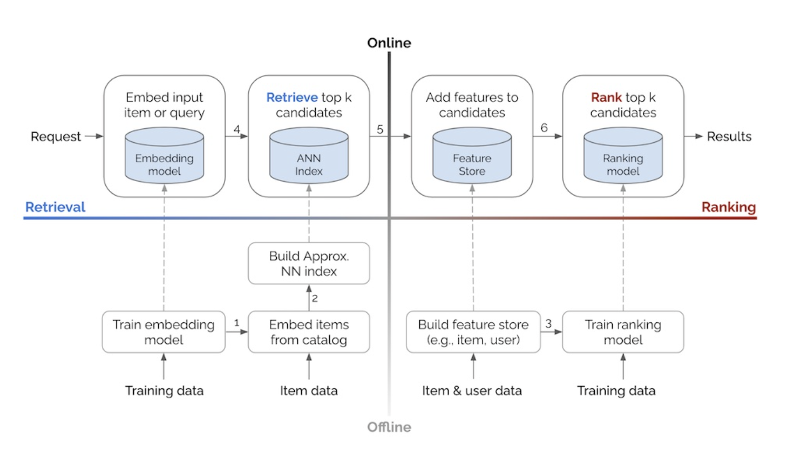
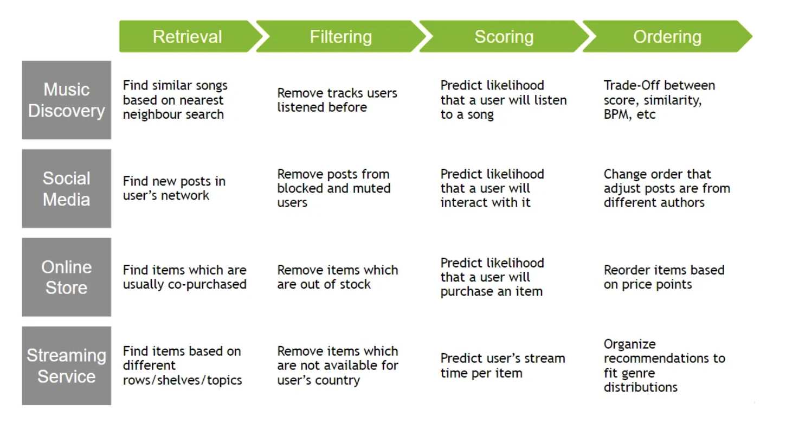
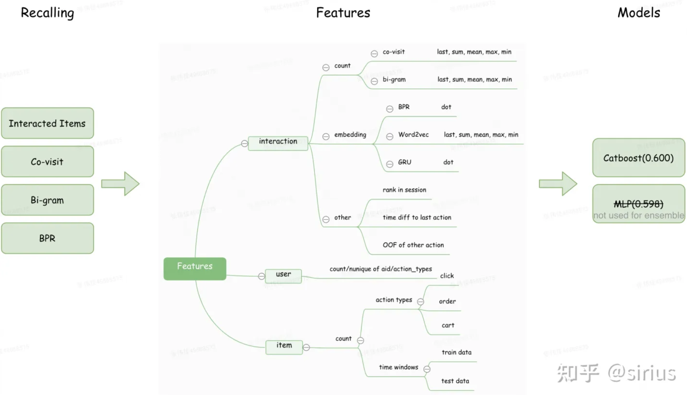

# 设计推荐系统
配合[推荐系统理论](../../02_ml/17_recommendation.md)

推荐系统的重要性源自**信息过载**与**人们行为的长尾分布**. 目的是Link user with items in a reasonable way.

### Functional requirement
- what is the product for which we have to build a recommendation system
- which part should we focus on
- Who is the producer/consumer
- are we a new product or we have some current product built already
- Is there any demography or country we are targeting
- the biggest goal of any product recommendation system is user engagement. Can I assume that to be the goal?
- How are we different from XX?
- Text or image/ video
- Ranking / Localization
- Permission management

### NonFunctional requirement
- MVP and Non-MVP
- users should have a real time/ near real time / small latency experience Idempotency/ exact-once/ at-least-once/ at-most-once
- reliability: data not get lost/ job not executed in parallel retention policy
- security: store encoded personal data
- consistency: read/ write heavy

### Capacity planning
- dau
- qps
- peak qps

## 结构

**数据层**
- 通过客户端以及服务端的实时数据，经过流处理的平台，把用户、商品、场景的信息以及端侧的信息全部都收集全
- 再通过特征工程的很多方法，如归一化、离散化、非线性离散等很多的变换，把特征处理成下游模型处理的方式。
- 处理完后一般会放在特征存储中，如 KV 存储:  Redis、阿里的 iGraph 等

**特征**

- dense feature
  - log变换
  - 分箱，可以根据业务分箱，分箱思路：等频，等宽，卡方
- sparse feature
  - onehot
  - embedding
    - [电商场景下的itemid有上亿，embedding](https://zhuanlan.zhihu.com/p/397600084)

**召回**
- 召回系统的要求是，“低延时”与“高精度（precision）
- 负样本选择
- model
  - 规则：热度高，同一作者、tag
  - itemCF
  - two power 
  - embedding: graph, picture, text
- 局部敏感哈希，KD树

**排序**
- 粗排、精排、重排
- multi-task deep learning
- 粗排一致性
- feature/embedding
- model
  - rule based model
  - 转化为classification/regression模型
  - matrix factorization
  - factorization machine
  - wide and deep learning

### Diagram & API
- pagination + sort_key / video start timestamp / offset, page_size
- user context/ client info(ios, network condition) diagram
- list high level diagram first, then each component
- different choices/ tradeoffs and give your recommendation
- MQ or no mq
- cache: consistency/ failure/ cold start
- data model/database: 1 master, 2 replica, primary key, user_id, timestamp, status

### DataSchema & Scale

### Monitoring & Metrics
注意区分statistical metric和business metric。后者意义更大，但经常无法直接optimize，只能通过ab-testing测试。
- 电商：根据业务需要，在 GMV (商品交易总额) 主目标之外，通常还要兼顾 IPV、转化率、人均订单数等多个次目标
- ctr（点击率）和 CVR (Conversion Rate) 转化率
- impression per second
- candidate count (from recall)
- budget burn rate
- 通用metrics：cpu, qps, latency
- 淘宝主搜将 “全域成交 Hitrate” 作为粗排最重要的评价标准，提出两类评价指标，分别描述“粗排->精排损失”和“召回->粗排损失”。

## 特定情况
针对不同领域，如电商、O2O，针对领域提出针对性的优化
- 电商推荐业务：曝光->点击->购买
- 地点约束，例如yelp的饭馆推荐涉及geolocation information
- user的 graph network，例如facebook newsfeed推荐
- 音乐、视频的embedding，例如spotify音乐推荐
- Ins Story推荐，每条Story是独一无二的并且是有时间性的
- O2O场景广告特点 1、移动化 2、本地化 3、场景化 4、多样性
- Point of interest
- Reels recommendation

## 问答
- 数据采集和处理
  - 如何建立index
- 怎么做counterfactual evaluation
- 怎么deploy?
  - embedding retrieval
- 怎么上线？
  - A/B testing, metric
- 连续特征离散化方法以及为什么需要对连续特征离散化
- FM、FFM的参数量以及时间复杂度
- 多目标模型
  - 参数共享及不共享参数各自的优缺点  
- 用户长期兴趣和多兴趣怎么建模
- DPP多样性算法
- 冷启动
  - 如何冷启动
- bias
  - 如何解决 position bias/popularity bias
- 对热门的打压
  - swing相似度计算中，把共同点击商品A和B的用户pair对的交集放在分母，对热门用户行为的打击
- 模型更新策略, retrain plan
  - embedding的更新
  - 全量更新：可以每天更新一次，shuffle, 更新ID embedding 和全连接层，1 epoch。每次更新的还是上一天的全量的模型更新，而不是增量
  - 增量更新：不停做，可以几十分钟更新一次，online learning只更新ID embedding参数, 尽量实时追踪用户兴趣。但其实是有偏的
- 怎么加user and item metadata
- 线上评价，线上线性不一致
- model debugging, offline online inconsistency, light ranking, ab test, heavy ranking, two tower
- 向量召回、排序没用实时行为序列特征
- 统计特征用等宽分桶导致特征值聚集
- 召回没做场景适配，比如相关推荐场景还在用猜你喜欢的召回
- 多语言搜索召回率低
- 有些国家节日多，模型T+1更新导致节日后消费数据下降
- 有一些情况下同一用户对不同item的 pctr 是同一个值
- 模型目标和业务目标不一致
- Itemid hash 碰撞率太高
- E&E
  - embedding: 特征转化为可以学习的向量，模糊查找
  - embedding in sequence: 共现
- 向量召回
  - faiss: faiss使用了PCA和PQ(Product quantization乘积量化)两种技术进行向量压缩和编码
- 多任务
- 多场景
  - 不同用户群体（如新老用户）、APP不同频道模块、不同客户端等

## Reference
- [Recommendations: What and Why?](https://developers.google.com/machine-learning/recommendation/overview)
- [https://github.com/Doragd/Algorithm-Practice-in-Industry](https://github.com/Doragd/Algorithm-Practice-in-Industry)
- [超详细：完整的推荐系统架构设计](https://xie.infoq.cn/article/e1db36aecf60b4da29f56eeb4)
- [https://github.com/wzhe06/SparrowRecSys](https://github.com/wzhe06/SparrowRecSys)
- [推荐系统--完整的架构设计和算法(协同过滤、隐语义)](https://zhuanlan.zhihu.com/p/81752025)
- [https://www.6aiq.com/article/1553963227373](https://www.6aiq.com/article/1553963227373)
- [https://github.com/jiawei-chen/RecDebiasing](https://github.com/jiawei-chen/RecDebiasing)
- [闲鱼搜广推类技术文章汇总](https://zhuanlan.zhihu.com/p/603997107)
- [Improving Deep Learning for Ranking Stays at Airbnb](https://medium.com/airbnb-engineering/improving-deep-learning-for-ranking-stays-at-airbnb-959097638bde)
- [Machine Learning-Powered Search Ranking of Airbnb Experiences](https://medium.com/airbnb-engineering/machine-learning-powered-search-ranking-of-airbnb-experiences-110b4b1a0789)
- [wish冷启动](https://kojinoshiba.com/recsys-cold-start/)
- [阿里-推荐系统综述](https://mp.weixin.qq.com/s/e9xjwefYk2toN9CGK5uPXg)
- [推荐算法优化闲聊](https://zhuanlan.zhihu.com/p/665102155)
- [负样本为王：评Facebook的向量化召回算法](https://zhuanlan.zhihu.com/p/165064102)
- [探讨特征工程的方法论](https://zhuanlan.zhihu.com/p/466685415)
- [现在互联网公司还有做特征工程的工作吗？](https://www.zhihu.com/question/512722857)
- [DLRM](https://arxiv.org/abs/1906.00091)
- [Recommender Systems, Not Just Recommender Models](https://medium.com/nvidia-merlin/recommender-systems-not-just-recommender-models-485c161c755e)
- [spotify_mpd_two_tower](https://github.com/jswortz/spotify_mpd_two_tower)
- [在工业界，应用 Multi-Armed Bandit 的例子多吗？ - 曾文俊的回答 - 知乎](https://www.zhihu.com/question/293811863/answer/843666533)
- [强化学习在美团“猜你喜欢”的实践](https://tech.meituan.com/2018/11/15/reinforcement-learning-in-mt-recommend-system.html)
- [MLSYS-深度推荐系统](https://openmlsys.github.io/chapter_recommender_system/system_architecture.html)
- [https://research.facebook.com/blog/2018/5/the-facebook-field-guide-to-machine-learning-video-series/](https://research.facebook.com/blog/2018/5/the-facebook-field-guide-to-machine-learning-video-series/)
- [推荐系统架构](https://www.zhihu.com/people/yan-yiceng/posts)
- 