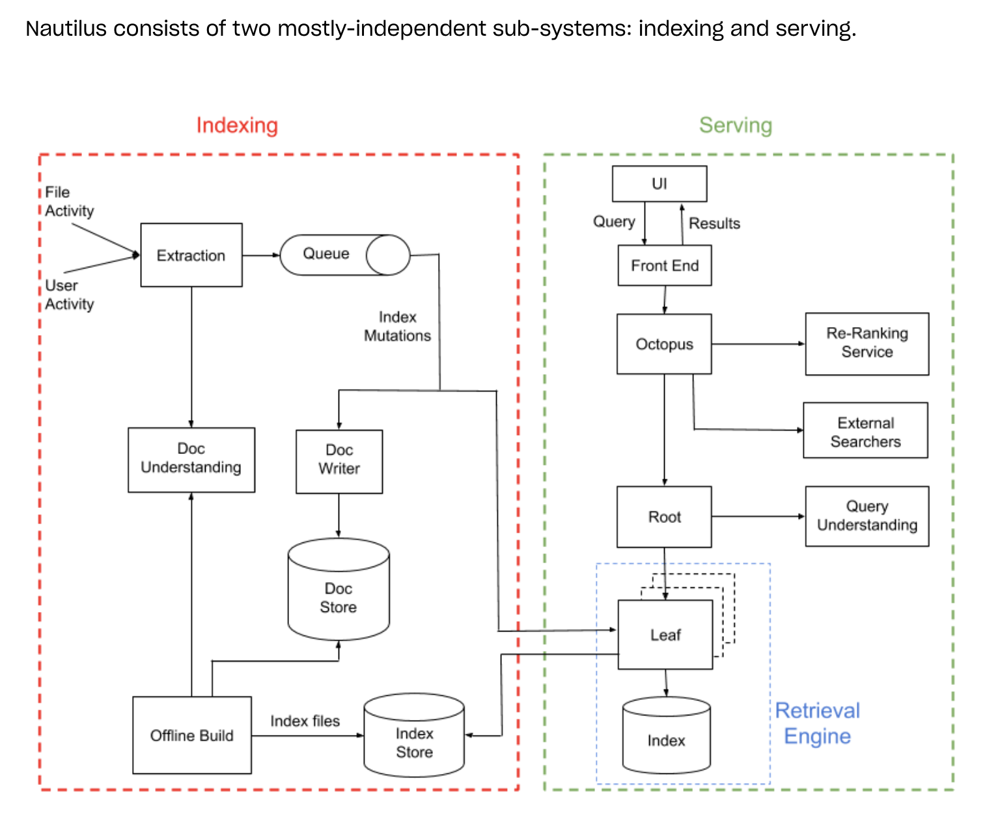
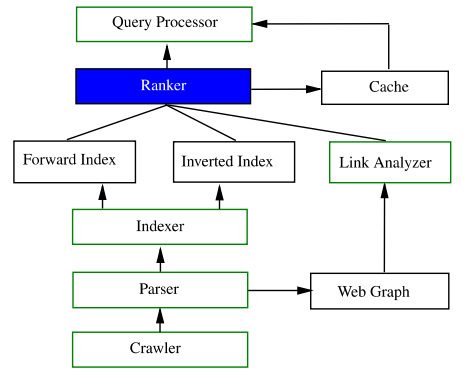

# 搜索引擎

搜索和推荐都是向用户提供用户需要的信息，搜索，由用户检索"拉动"，包含"Query"；推荐的基本是"推动"，由系统进行推送。

有的业务场景中，通过q2i的用户反馈信息进行排序，进一步提升业务指标。

## 1. requirements

**产品/功能/use cases**

- Is it a generalized search engine (like google) or specialized (like amazon product)?
- What are the specific use cases and scenarios where it will be applied?
- What are the system requirements (such as response time, accuracy, scalability, and integration with existing systems or platforms)?
- How many languages needs to be supported?
- What types of items (products) are available on the platform, and what attributes are associated with them?
- What are the common user search behaviors and patterns? Do users frequently use filters, sort options, or advanced search features?
- Are there specific search-related challenges unique to the use case (e-commerce)? such as handling product availability, pricing, and customer reviews?

**目标类**

- What is the primary (business) objective of the search system?
- Personalized? not required

**约束类**

- Is their any data available? What format?
- response time, accuracy, scalability (50M DAU)
- budget limitations, hardware limitations, or legal and privacy constraints
- What is the expected scale of the system in terms of data and user interactions?

## 2. ML task & pipeline

搜索，先对文档进行预处理并建立索引，根据用户查询，从索引中查询匹配，然后排序返回。

搜索引擎的六个核心组件：爬虫、解析、索引、链接关系分析、查询处理、排名.

query understanding

- 预处理，无效字符、表情直接丢掉，截取前n个字等
- 纠错，包括错误检测和自动纠错，目前的方法有：噪声信道模型、序列标注模型、seq2seq模型
- 分词&词性标注，一般都是现成的分词工具+用户词典来做了
- 词权重计算，计算每个词的重要性，一般会根据用户的点击日志离线算好
- 同义词
- 意图分析，为了意图可以扩充，所以一般做成很多个二分类任务，方法比较多，最常见的还是CNN，也有BERT蒸馏到CNN的
- 实体识别，识别搜索词中的实体词，一般也是序列标注模型BILSTM+CRF，或者BERT蒸馏到BILSTM
- 丢词，因为目前的搜索引擎更多的是还是以文本匹配的方式进行文档召回，所以如果query中有一些语义不重要的词，那就会丢弃了，并且往往会有多次丢词，比如：北京著名的温泉，在进行召回的时候，会先丢弃“的”字，以“北京、著名、温泉”三个词去和文档集求交集，如果没有好的结果，这三个词会继续丢词，以“北京、温泉”和文档集求交集，这里一般也是用序列标注来做
- Query改写，其实丢词&纠错也都算改写的一种，不过这里的改写是指找到原始Query的一些等价或者近似Query，规则的方法比较多，也有用seq2seq的

整个搜索召回的流程大致如下，以搜索“北京著名的温泉”为例：

1. 对输入的查询进行预处理，比如特殊字符处理、全半角转换。
2. 查询分词和词性标注，“北京”是地名、“著名”是形容词、“的”是助词、“温泉”是名词。
3. 基于词表的一次丢词，“的”作为停用词被丢弃。
4. 同义词改写，对分词的Term匹配同义词，如“温泉”和“热泉”是同义词。
5. 在同义词改写的同时分析chunk tag，“北京”是城市、“著名”是品类修饰词、“温泉”是品类词。
6. 基于Chunk分析的结果识别Query整体为品类意图。
7. 同时计算Term在Query中的重要度，“北京”为0.48、“著名”为0.39、“温泉”为0.55。
8. 基于品类意图确定检索字段和相关性计算的逻辑，比如距离加权。
9. 由于所有POI的文本字段中都不包含“著名”，一次召回无结果，因此扩大POI范围，在无合作POI集合中进行二次检索。
10. 由于无合作POI的文本字段也不包含“著名”，二次召回也无结果，因此基于Chunk丢弃品类修饰词“著名”，然后进行三次检索。
11. 最终返回搜索结果列表，“顺景温泉”、“九华山庄”等北京著名温泉。

## 3. data collection

- The ranking was good if the user clicked on some link and spent significant time reading the page.
- The ranking was not so good if the user clicked on a link to a result and then hit “back” quickly.
- The ranking was bad if the user clicked on the “next page” link.

## 4. feature

- user
- context
- query
- item
- user-item
- query-item

## 5. model

- 多策略关键词挖掘(SPU挖掘/Searchable Product Unit)
- Point-wise LTR, pairwise LRT
- rerank

## 6. evaluation

**offline**

**online**

- 相关性
- 内容质量
- 时效性
- 个性化

## 7. deploy & serving

A/B test

## 8. monitoring & maintenance

## reference

- [Architecture of Nautilus, the new Dropbox search engine](https://dropbox.tech/machine-learning/architecture-of-nautilus-the-new-dropbox-search-engine)
- [腾讯搜索词推荐算法探索实践](https://mp.weixin.qq.com/s/4j3VZ8yNqwm6FJI9UFOlnw)
- [美团搜索中查询改写技术的探索与实践](https://tech.meituan.com/2022/02/17/exploration-and-practice-of-query-rewriting-in-meituan-search.html)
- [搜索广告召回技术在美团的实践](https://tech.meituan.com/2024/07/05/the-practice-of-search-advertising-recall-technology-in-meituan.html)
- Ranking Relevance in Yahoo Search，KDD 2016
- [Embedding-based Retrieval in Facebook Search, KDD 2020](https://arxiv.org/pdf/2006.11632)
- Poly-encoders: Transformer Architectures and Pre-training Strategies for Fast and Accurate Multi-sentence Scoring，ICLR 2020
- Approximate Nearest Neighbor Negative Contrastive Learning for Dense Text Retrieval, ICLR 2021
- [Listing Embeddings in Search Ranking](https://medium.com/airbnb-engineering/listing-embeddings-for-similar-listing-recommendations-and-real-time-personalization-in-search-601172f7603e)
- [COTA: Improving Uber Customer Care with NLP & Machine Learning](https://www.uber.com/en-SG/blog/cota/)
- [Scaling Uber’s Customer Support Ticket Assistant (COTA) System with Deep Learning](https://www.uber.com/en-SG/blog/cota-v2/)
- [美团外卖搜索基于Elasticsearch的优化实践](https://tech.meituan.com/2022/11/17/elasicsearch-optimization-practice-based-on-run-length-encoding.html)
