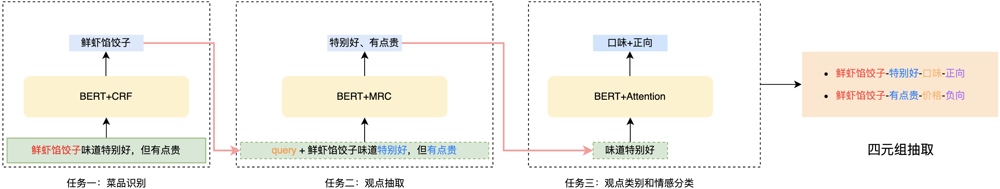

# 情感分析

## 1. requirements

**constraint**
- latency: how long it takes a single request
- throughput: how many request can be handled in a given amount of time

## 2. ML task & pipeline

## 3. data collection
- 收集data
  - GDPR（privacy），数据脱敏，数据加密
- 分析data。考虑label的distribution
- 考虑feature是不是只有text的，还是有numeric，nominal的。missing data怎么处理

## 4. feature
- text的feature怎么生成embedding，好处坏处有哪些。（word embedding, fasttext, BERT）
- numeric的missing data,如何normalize
- 实际工作中，都是每个ML组都有自己不同的embedding set。互相使用别人的embedding set。怎么pre-train, fine-train, 怎么combine feature

## 5. model
- 模型选择: 传统模型还是神经网络
- 考虑系统方面的constraint, 如prediction latency, memory. 怎么合理的牺牲模型的性能以换取constraint方面的benefit
- 模型蒸馏

## 6. evaluation

- train, test, validation split data
- evaluation matrix
- feature的ABtest怎么做

## 7. deploy & serving
- GPU or CPU
- 单机多进程 or Spark + Broadcast, KF-serving
- dynamic batching
- Dynamic Model Input (输入数据的长度)
- quantization (cast)
- distill/or smaller model
- onnx
  - 不同的硬件和推理引擎兼容
  - 进一步优化: 算子融合、内存优化和硬件加速
- caching responses to reduce the request

## 8. Monitor & maintenance
- hardware usage
- serving usage: qps
- model performance
- business object

## 9. 优化与问答
- train/test data和product上distribution不一样怎么办
- data distribution 随着时间改变怎么办

## reference
- [细粒度情感分析在到餐场景中的应用](https://tech.meituan.com/2021/12/09/meituan-aspect-based-sentiment-analysis-daodian.html)
- [情感分析技术在美团的探索与应用](https://tech.meituan.com/2021/10/20/the-applications-of-sentiment-analysis-meituan.html)
- [learn.microsoft.com/en-us/azure/ai-services](https://learn.microsoft.com/en-us/azure/ai-services/language-service/sentiment-opinion-mining/overview?tabs=prebuilt)
- [Using Sentiment Score to Assess Customer Service Quality](https://medium.com/airbnb-engineering/using-sentiment-score-to-assess-customer-service-quality-43434dbe199b)
- [System Design of Extreme Multi-label Query Classification using a Hybrid Model](https://sigir-ecom.github.io/ecom2019/ecom19Papers/paper19.pdf)
- [Query理解在美团搜索中的应用 - DataFunTalk的文章 - 知乎](https://zhuanlan.zhihu.com/p/370576330)
- [How to Fine-Tune BERT for Text Classification?](https://arxiv.org/pdf/1905.05583)
- [How We Scaled Bert To Serve 1+ Billion Daily Requests on CPUs](https://medium.com/@quocnle/how-we-scaled-bert-to-serve-1-billion-daily-requests-on-cpus-d99be090db26)
- [FastFormers: Highly Efficient Transformer Models for Natural Language Understanding](https://arxiv.org/abs/2010.13382)
- [Understanding Pins through keyword extraction](https://medium.com/pinterest-engineering/understanding-pins-through-keyword-extraction-40cf94214c18)
- [华为云细粒度文本情感分析及应用](https://mp.weixin.qq.com/s/yeiODUxkTpvi2AsghjbeeQ)
