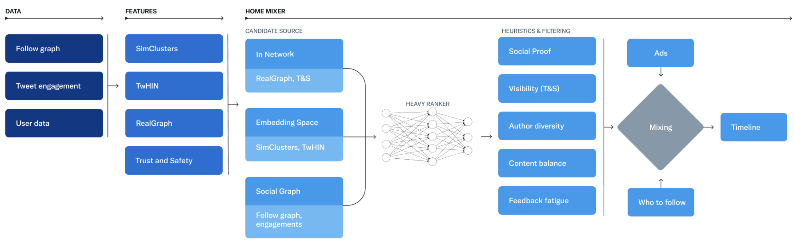

# twitter推荐

> twitter比较关注social graph的挖掘

## 1. requirements
**BG & product**
- homepage feed?
- user: follow
- item: text, image, video
- engagement: click, like, comment, share

## 2. pipeline

召回、精排、规则多样性重排、混排

- Fetch the best Tweets from different recommendation sources in a process called candidate sourcing.
- Rank each Tweet using a machine learning model.
- Apply heuristics and filters, such as filtering out Tweets from users you’ve blocked, NSFW content, and Tweets you’ve already seen.

## 3. data collection

## 4. feature

## 5. model

### 5.1 retrieval

- In-Network召回
- Out-of-Network 召回

### 5.2 ranking

- MaskNet

### 5.3 reranking

- 过滤已屏蔽用户的推文、NSFW内容和已看过的推文

## 6. evaluation

## 7. deploy & serving

## 8. monitoring & maintenance

## reference
- [https://github.com/twitter/the-algorithm](https://github.com/twitter/the-algorithm)
- [https://github.com/twitter/the-algorithm-ml](https://github.com/twitter/the-algorithm-ml)
- [Twitter's Recommendation Algorithm](https://blog.twitter.com/engineering/en_us/topics/open-source/2023/twitter-recommendation-algorithm)
- [MaskNet: Introducing Feature-Wise Multiplication to CTR Ranking Models by Instance-Guided Mask](https://arxiv.org/pdf/2102.07619.pdf)
- [Twitter是怎么做推荐的？马斯克开源代码梳理](https://zhuanlan.zhihu.com/p/618667508) 
- [微博推荐实时大模型的技术演进](https://mp.weixin.qq.com/s/wRi0YJLpru5M1My0H2Ww0w)
