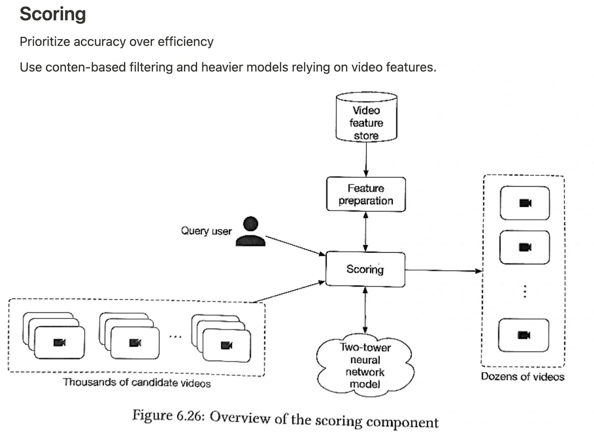
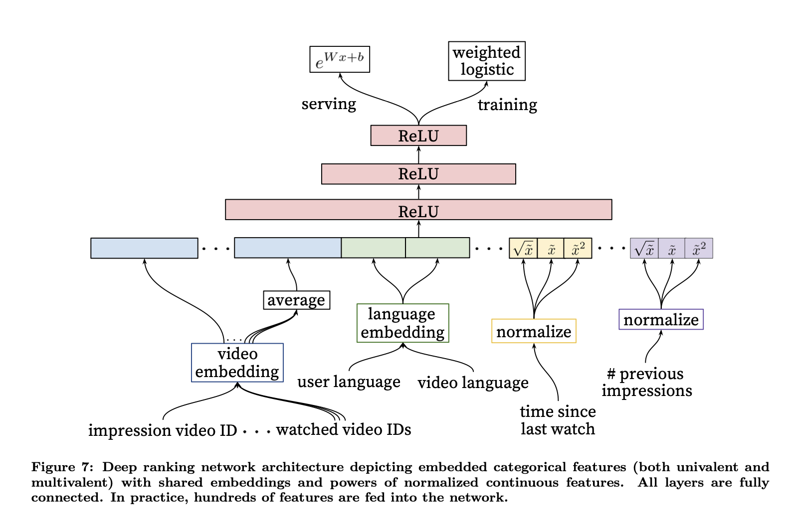

# Youtube 视频推荐

## 1. 需求 requirements

**场景/功能类**
- Use case
  - Homepage? similar item recommendation?
  - Similar to previously played, or personalized for the user?
  - UGC(user generated content) or not? penetration rate as goal if UGC, 即时曝光new content
  - Do users have any favorite lists, play later, etc?
  - 项目阶段，是否都是冷启动数据，还是已经有了交互
- user info: can users become friends on the platform and do we want to take that into account?
- item info: any text, tag, image, video
- engagement type: click, like, share, comment
  - explicit feedback? (thumbs up/down, in-product surveys), implicit user history

**目标类**
- Business objective?
  - Increase user engagement (play, like, click, share), purchase?, create a better ultimate gaming experience
  - maximize users’ engagement and recommend new types of content to users
- For online recommendations, it’s important to find the balance between exploration vs. exploitation. If the model over-exploits historical data, new videos might not get exposed to users. We want to balance between relevancy and fresh new content.
- diversity

**约束类**
- Data access
  - Do we log and have access to any data? Can we build a dataset using user interactions?
- Latency requirements
  - For every user to visit the homepage, the system will have to recommend 100 videos for them. The latency needs to be under 200ms, ideally sub 100ms.
- scale: how many user and item
  - How many videos? 100 million
  - How many users? 100 million DAU

## 2. 架构 architectural components

根据需求转化为一个机器学习问题(类型，输入、输出-机器学习Label)，并给出high level的设计。

- The reason for two stages is to make the system scale.
- [1] In this first stage, the system starts from a potentially huge corpus and generates a much smaller subset of candidates. For example, the candidate generator in YouTube reduces billions of videos down to hundreds or thousands. The model needs to evaluate queries quickly given the enormous size of the corpus. A given model may provide multiple candidate generators, each nominating a different subset of candidates.
- [2] Next, another model scores and ranks the candidates in order to select the set of items (on the order of 10) to display to the user. Since this model evaluates a relatively small subset of items, the system can use a more precise model relying on additional queries.
- [3] Finally, the system must take into account additional constraints for the final ranking. For example, the system removes items that the user explicitly disliked or boosts the score of fresher content. Re-ranking can also help ensure diversity, freshness, and fairness.

## 3. 数据收集 data collection

- Collect data on ad impressions, clicks, conversions, and user interactions.
- Capture user behavior data on your website or platform to understand post-click engagement.
- Gather ad creative data, such as headlines, images, and ad copy.

### 3.1 前处理

- Segment data by ad type, campaign, audience demographics, and other relevant factors to analyze performance at different levels.
- Clean and preprocess data to remove anomalies, missing values, and outliers.
- Removing duplicates
- filling missing values
- normalizing data

### 3.2 正负样本
- 召回负样本: 随机采样，batch内，粗排或精排过滤掉的
- 排序负样本: 曝光未点击

## 4. 特征 feature
- 用户特征，item特征，场景特征
  - 用户：用户画像特征、用户统计特征、用户行为特征
  - item：
  - 用户与item交叉特征：
  - 场景特征：有缺失，重要特征提升其覆盖率
- sparse和dense特征
  - 离散特征(ID，类目)做embedding
  - 连续特征（）转换 log1p, 分桶变成离散特征
- 根据特征需要的时效性（例如历史engagement）、变化频率(例如用户与item基本信息)、数据大小与计算快慢决定其存储与服务时获取的方式
  - 内存数据库：用户画像(少，偏静态)、item画像(多，静态)、统计特征（用户少，item多，时效要求高）

## 5. 模型 model
从简单可行的模型开始设计，不要追求fancy

### 5.1 召回

Candidate generation is the first stage of recommendation. Given a query (also known as context), the system generates a set of relevant candidates
- content-based filtering: Uses similarity between items to recommend items similar to what the user likes.
- collaborative filtering: Uses similarities between queries and items simultaneously to provide recommendations.
  - pros
    - Easy to discover users' new areas of interest
    - Efficient. Models based on CF are usually faster and less compute-intensive
  - cons
    - Cold-start problem
    - Cannot handle niche interests
- for large scale system (Facebook, Google), we don’t use Collaborative Filtering and prefer low latency method to get candidate. One example is to leverage Inverted Index (commonly used in Lucene, Elastic Search). Another powerful technique can be found FAISS or Google ScaNN

**负样本选择**
- 简单负样本: 没有被召回的样本，全体样本中采样。根据热门/冷门进行随机非均匀，抽样概率与热门程度(点击次数)正相关，次数的0.75次方
- 简单负样本: batch负样本，对比学习
- 困难负样本: 被粗排淘汰的物品，精排分数靠后的物品
- 注意不能选择精排的"曝光未点击"作为负样本，精排的样本是感兴趣与非常感兴趣的区别，不一定是不感兴趣，召回需要见多识广

**双塔模型**
- Two-tower architectures can capture the semantics of query and candidate entities, and map these to a shared embedding space such that semantically similar entities cluster closer together
- 步骤：1 离线训练得到user/item embedding, 2 离线建立item的索引，3 在线，计算user embedding，搜索item top n相似度
- 损失函数：[计算the dot product representing their similarity，batch内负样本](https://github.com/tensorflow/recommenders/blob/main/tensorflow_recommenders/tasks/retrieval.py)
- 数据：Training data is sourced from positive <query, candidate> pairs
- pros
  - latency and scalability
- cons
  - cold start

### 5.2 排序

排序算法给召回的每一个物品ID打分。优化目标有：pairwise，pointwise，listwise。pairwise是搜索排序提出的，正负例之间是有明显界限。对于推荐排序，是基于场景的，用户的反馈具有随机性，因此推荐排序pointwise经常优于parewise。

多目标最终如何给出排序
- 预估分数融合
- 图文笔记排序的主要依据: 点击、点赞、收藏、转发、评论; 视频排序的依据还有播放时长和完播

### 5.3 重排

- 视频要否要先通过审核
- region restricted videos
- videos freshness
- video spreading misinformation
- duplicated
- fairness and bias

## 6. 评价 evaluation metrics

- North star metric
  - Watch time, Other metrics : No. of photos watched, engaged with ( by clicking, commenting, liking etc.) DAU, WAU, MAU, Stickiness, Weekly retention, 30 day retention etc
- offline
  - precision, recall, ranking loss, and logloss
- online
  - Use A/B testing to compare Click Through Rates, watch time, and Conversion rates.
  - **Click-Through Rate (CTR):** The ratio of clicks to impressions, indicating the effectiveness of an ad in attracting user attention
  - **Conversion Rate:** The ratio of conversions (e.g., sign-ups, purchases) to clicks, measuring how well an ad drives desired actions.
  - **Return on Ad Spend (ROAS):** The revenue generated from an ad campaign divided by the cost, demonstrating the profitability of the campaign.
  - **Quality Score:** A score assigned to ads based on relevance, user experience, and expected click-through rate.
  - **Engagement Metrics:** Metrics like bounce rate, time on site, and pages per visit to assess the quality of user engagement with the landing page after clicking on the ad.
- split the data

## 7. deployment and prediction service

- [Online predictions](https://cloud.google.com/vertex-ai/docs/predictions/overview#online_predictions)
  - are synchronous requests made to a model that is deployed to an endpoint. Therefore, before sending a request, you must first deploy the Model resource to an endpoint. This associates compute resources with the model so that it can serve online predictions with low latency. Use online predictions when you are making requests in response to application input or in situations that require timely inference.
  - rest/grpc
- Batch predictions 
  - are asynchronous requests made to a model that isn't deployed to an endpoint. You send the request (as a BatchPredictionsJob resource) directly to the Model resource. Use batch predictions when you don't require an immediate response and want to process accumulated data by using a single request.
  - precomputed, decouple compute from serving, lower load. 周期性更新，比如贷中评分，推荐系统的客户画像，一些dashboard，linkedin job推荐

- application server
- candidate generation service
  - two-tower network inference: find the k-top most relevant items given a user ->
  - It's a classic nearest neighbor problem -> use approximate nearest neighbor (ANN) algorithms
- ranking service

## 8. monitoring and maintenance

- User behavior is generally unpredictable, and videos can become viral during the day. Ideally, we want to train many times during the day to capture temporal changes

## 9. 问答

- cold start
  - new users
    - use user basic features, like age, gender
    - after the user interacts with more videos, better
  - new videos
    - use basic metadata and content
    - display videos to random users to collect interaction data
- bias
  - 向量召回过程中如何打压热门视频, popularity trap
    - youtube论文，训练时cosine(a, bi)-log(pi), 预测时cosine(a, bi)
- further optimization

## 参考
**精读**
- [论文: Deep Neural Networks for YouTube Recommendations](https://static.googleusercontent.com/media/research.google.com/en//pubs/archive/45530.pdf)
- [论文: Sampling-Bias-Corrected Neural Modeling for Large Corpus Item Recommendations](https://research.google/pubs/sampling-bias-corrected-neural-modeling-for-large-corpus-item-recommendations/)
- [论文: Recommending What Video to Watch Next: A Multitask Ranking System](https://daiwk.github.io/assets/youtube-multitask.pdf)
- [Netflix: System Architectures for Personalization and Recommendation](https://netflixtechblog.com/system-architectures-for-personalization-and-recommendation-e081aa94b5d8)

**扩展**
- [alirezadir/Machine-Learning-Interviews](https://github.com/alirezadir/Machine-Learning-Interviews/blob/main/src/MLSD/mlsd-video-recom.md)
- [https://github.com/wangshusen/RecommenderSystem](https://github.com/wangshusen/RecommenderSystem)
- [Scaling deep retrieval with TensorFlow Recommenders and Vertex AI Matching Engine](https://cloud.google.com/blog/products/ai-machine-learning/scaling-deep-retrieval-tensorflow-two-towers-architecture)
- [虎牙直播推荐系统架构详解](https://mp.weixin.qq.com/s/5XDR_KyZZdh2kndFOBSHeA)
- [QQ音乐推荐系统算法架构实践](https://mp.weixin.qq.com/s/Si-zxdfcxaw2lmU9_qgOrw)
- [网易云音乐推荐系统的冷启动技术](https://mp.weixin.qq.com/s/EDkoe3nxvQ_24nxC8ktd7g)
- [双塔模型Batch内负采样如何解决热度降权和SSB的问题](https://zhuanlan.zhihu.com/p/574752588)
- [Mixed Negative Sampling for Learning Two-tower Neural Networks in Recommendations](https://research.google/pubs/pub50257/)
- [System Design for Recommendations and Search // Eugene Yan // MLOps Meetup #78](https://www.youtube.com/watch?v=lh9CNRDqKBk)
- [推荐系统-短视频推荐中的一些记录 - tangwang的文章 - 知乎](https://zhuanlan.zhihu.com/p/720272682)
- [都说数据是上限，推荐系统ctr模型中，构造正负样本有哪些实用的trick？ - 傅聪Cong的回答 - 知乎](https://www.zhihu.com/question/324986054/answer/1771305509)
