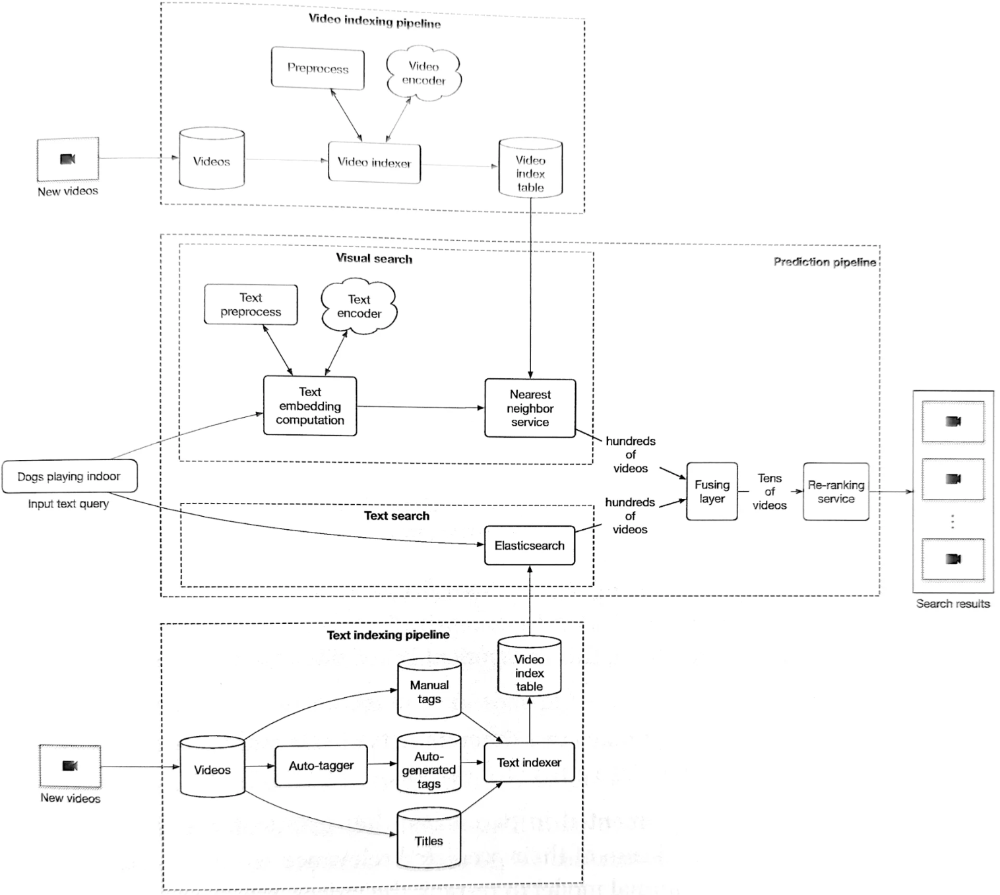
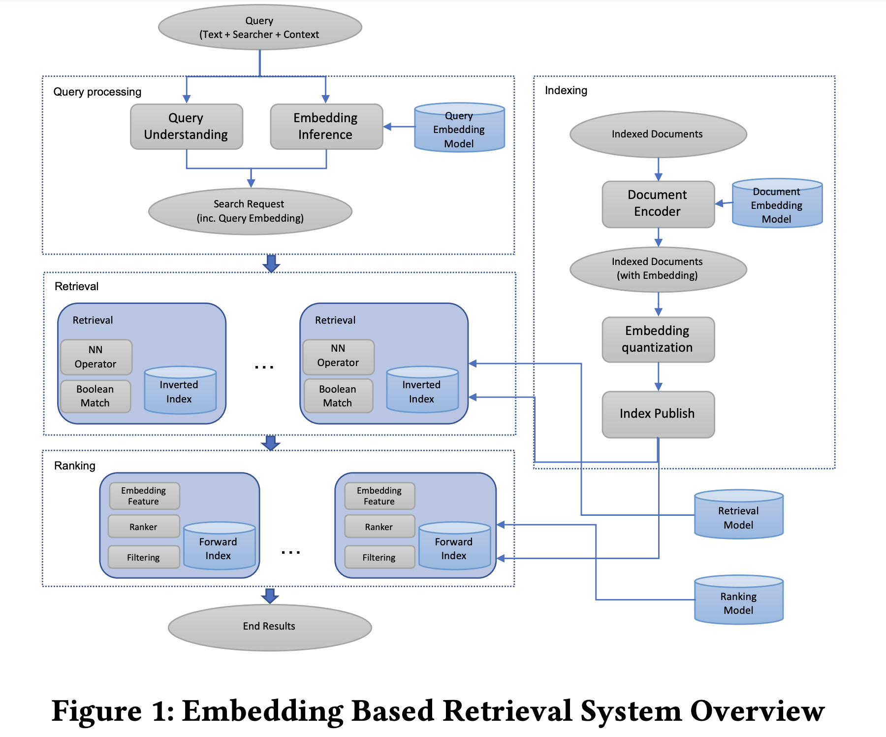
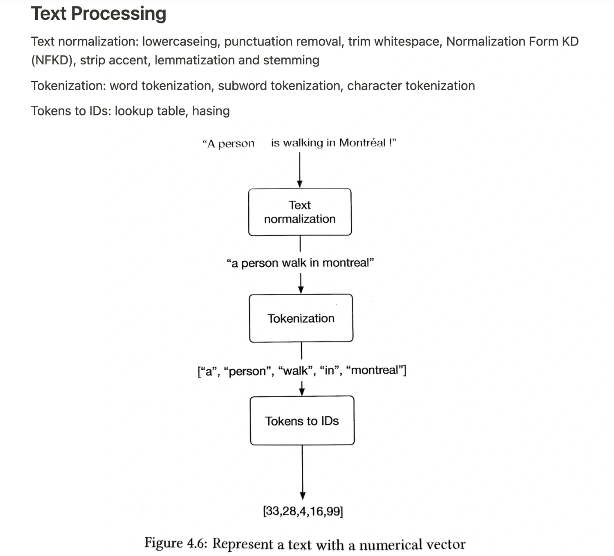
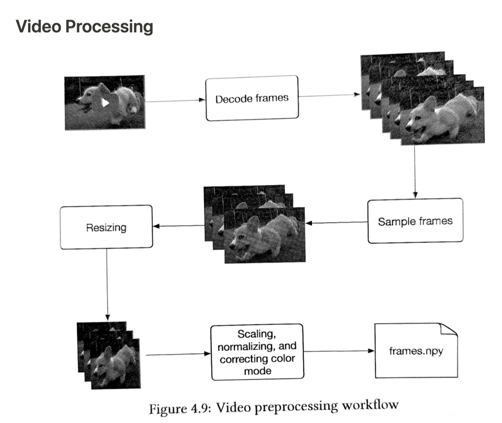
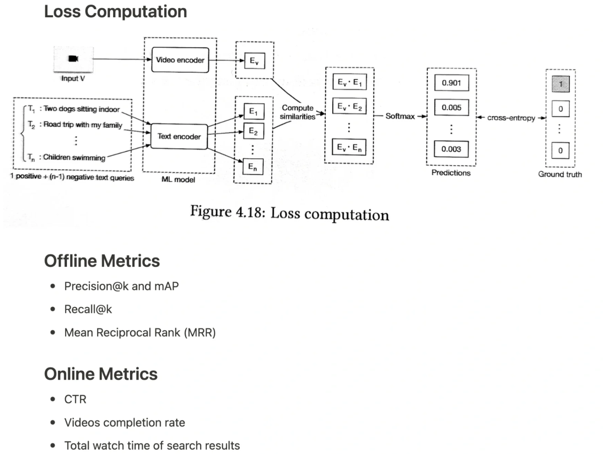

# Youtube视频搜索

## 1. requirements
> 搜索的核心是relevance

- What is the primary (business) objective of the search system?
- What are the specific use cases and scenarios where it will be applied? general search or vertical domain search
- What are the system requirements (such as response time, accuracy, scalability, and integration with existing systems or platforms)?
- What is the expected scale of the system in terms of data and user interactions?
- Is their any data available? What format?
- Can we use video metadata? Yes
- Do we need consider **Personalization**? not required
- How many languages needs to be supported?

## 2. pipeline

## 3. data collection

## 4. feature

## 5. model

text

video

loss

## 6. Evaluation

- Offline
  - Precision@k, mAP, Recall@k, MRR
  - we choose MRR (avg rank of first relevant element in results) due to the format of our eval data <video, text> pair
- Online(A/B test)
  - CTR: problem: doesn't track relevancy, click baits
  - video completion rate: partially watched videos might still found relevant by user
  - total watch time
  - we choose total watch time: good indicator of relevance

## 7. deployment and prediction service
- Scaling

## 8. monitoring and maintenance

## reference
- [Embedding-based Retrieval in Facebook Search](https://arxiv.org/abs/2006.11632)
- [Que2Search: Fast and Accurate Query and Document Understanding for Search at Facebook](https://research.facebook.com/publications/que2search-fast-and-accurate-query-and-document-understanding-for-search-at-facebook/)
- [System Design for Recommendations and Search](https://eugeneyan.com/writing/system-design-for-discovery/)
- [Applying Deep Learning To Airbnb Search](https://arxiv.org/pdf/1810.09591.pdf)
- [https://cloud.google.com/vertex-ai/docs/vector-search/overview?hl=en](https://cloud.google.com/vertex-ai/docs/vector-search/overview?hl=en)
- [大众点评搜索相关性技术探索与实践](https://zhuanlan.zhihu.com/p/538820569)
- [预训练技术在美团到店搜索广告中的应用](https://tech.meituan.com/2021/12/02/application-of-pre-training-technology-in-meituan-search-ads.html)
- [深度学习在搜索业务中的探索与实践](https://tech.meituan.com/2019/01/10/deep-learning-in-meituan-hotel-search-engine.html)
- [美团搜索粗排优化的探索与实践](https://tech.meituan.com/2022/08/11/coarse-ranking-exploration-practice.html)
- [美团点评旅游搜索召回策略的演进](https://tech.meituan.com/2017/06/16/travel-search-strategy.html)
- [How image search works at Dropbox](https://dropbox.tech/machine-learning/how-image-search-works-at-dropbox)
- [京东 Towards Personalized and Semantic Retrieval: An End-to-End Solution for E-commerce Search via Embedding Learning](https://arxiv.org/abs/2006.02282)
- [百度凤巢大模型与搜索广告满意度设计与实践](https://mp.weixin.qq.com/s/Mpi7wZlHw3eKPJzj00CPMw)
- [POI 识别在飞猪搜索的探索与实践](https://mp.weixin.qq.com/s/D1Ok5qS7X_iE-Bj4J2mIsA)
- [大众点评内容搜索算法优化的探索与实践](https://zhuanlan.zhihu.com/p/688404734)
- [Under the hood: Photo Search](https://engineering.fb.com/2017/05/22/ml-applications/under-the-hood-photo-search/)
- [万字浅析视频搜索系统中的多模态能力建设 - 徐土豆的文章 - 知乎](https://zhuanlan.zhihu.com/p/706294003)
